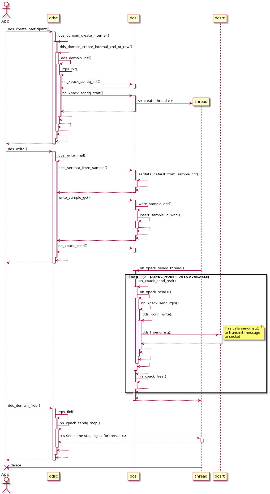

# Asynchronous write

`Asynchronous Write` is a feature where the actual sending of the data packets occurs on a different thread, than the thread where the `dds_write()` function is invoked. By default when application writes data using a DDS data writer, the entire write operation involving the steps from serialization to writing the actual data packets on to the socket happen synchronously in the same thread, which is called `Synchronous Write`. Applications can enable `Asynchronous Write` mode where the dds_write() call will only copy the data to the writer history cache and queues the data, but the actual transmission of the data happens asynchronously in a separate thread.

### Asynchronous write behavior

By default Cyclone DDS uses "synchronous write", to use "asynchronous write", the latency budget of a data writer should be greater than zero.

```c
  /* Create a Writer with non-zero latency budget */
  dwQos = dds_create_qos ();
  dds_qset_latency_budget(dwQos, DDS_MSECS(5));
  writer = dds_create_writer (participant, topic, dwQos, NULL);
  ...
  // This writer sends the data asynchronously
```

The below diagram shows the current API call sequence for the write:



- `sendq` thread (thread which is responsible for sending the data asynchronously) is started when the first data writer is created with a latency budget greater then zero.
- `sendq` thread is stopped during the shutdown clean-up
- When a sample is written in asynchronous mode, the following happens on the high level:
    - `ddsi_serdata` is constructed from the sample
    - Sample is inserted into writer history cache (WHC)
    - Packs the sample into RTPS message
    - Queues the RTPS messages
    - `sendq` thread transmits the queued RTPS messages asynchronously

### Improvements

1. Queue individual samples (`ddsi_serdata`), pack and send them instead of queueing and sending the entire RTPS messages. This will be an improvement for use case of sending small messages at high rates.