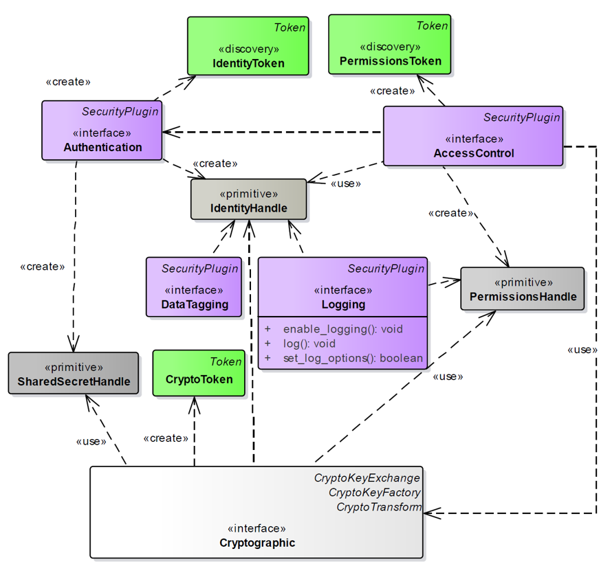
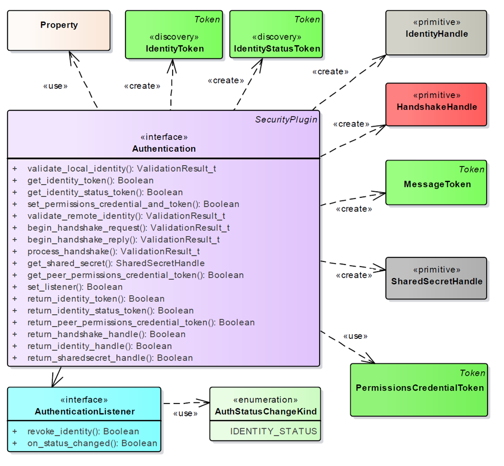
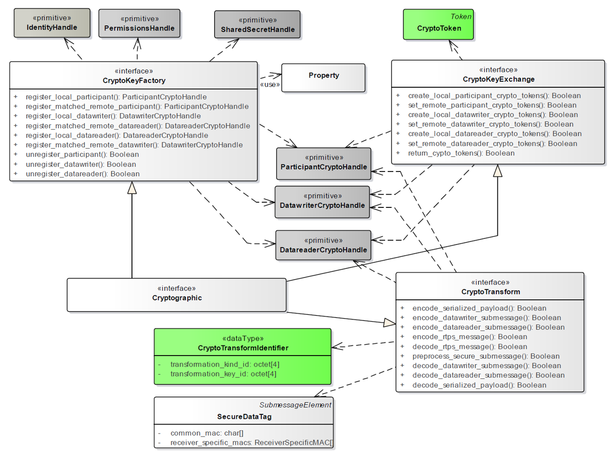
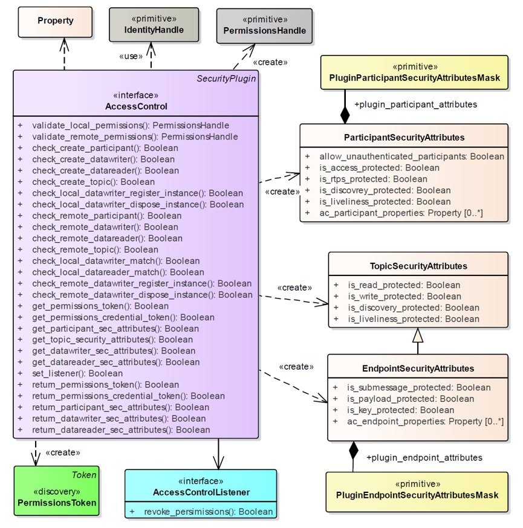

# Eclipse Cyclone DDS Module Layout

Cyclone DDS is made up of multiple modules, each of which provides a certain
set of functionality, either private, public or a combination thereof. Since
Cyclone DDS is a middleware product, the api is of course the most visible
interface. Cyclone DDS uses the *dds* (not followed by an underscore) prefix
to avoid name collisions with other code.

The fact that Cyclone DDS is made up of multiple modules is largely historic,
but does offer a neat way to separate features logically.

     |-------------|
     |             |  DDS is not a target, it is the product, the sum of the
     |     DDS     |  targets that together form Cyclone DDS. i.e. the stable
     |             |  api prefixed with dds\_ and the libddsc.so library.
     |---|---------|
     |   |         |  ddsc implements most of dds\_ api. A modern,
     |   |  ddsc   |  user-friendly implementation of the DDS specification.
     |   |         |
     |   |---------|
     |   |         |  ddsi, as the name suggests, is an implementation of the
     |   |  ddsi   |  RTPS-DDSI specification.
     |   |         |
     |   |---------|
     |             |  ddsrt offers target agnostic implementations of
     |      ddsrt  |  functionality required by the ddsc and ddsi targets, but
     |             |  also exports a subset of the dds\_ api directly. e.g.
     |-------------|  dds_time_t and functions to read the current time from
                      the target are implemented here.

> The need for a separate utility module (util) has disappeared with the
> restructuring of the runtime module. The two will be merged in the not too
> distant future.

All modules are exported separately, for convenience. e.g. the *ddsrt* module
offers target agnostic interfaces to create and manage threads and
synchronization primitives, retrieve resource usage, system time, etc.
However, all symbols not referenced by including *dds.h* or prefixed with
*dds_* are considered internal and there are no guarantees with regard to api
stability and backwards compatibility. That being said, they are not expected
to change frequently. Module specific headers are located in the respective
directory under `INSTALL_PREFIX/include/dds`.

## DDS Runtime (ddsrt)
The main purpose of the runtime module is to allow modules stacked on top of
it, e.g. ddsi and dds, to be target agnostic. Meaning that, it ensures that
features required by other modules can be used in the same way across supported
targets. The runtime module will NOT try to mimic or stub features that it can
simply cannot offer on a given target. For features that cannot be implemented
on all targets, a feature macro will be introduced that other modules can use
to test for availability. e.g. *DDSRT_HAVE_IPV6* can be used to determine if
the target supports IPv6 addresses.

### Feature discovery
Discovery of target features at compile time is largely dynamic. Various target
specific predefined macros determine if a feature is supported and which
implementation is built. This is on purpose, to avoid a target specific
include directory and an abundance of configuration header files and works
well for most use cases. Of course, there are exceptions where the preprocessor
requires some hints to make the right decision. e.g. when the lwIP TCP/IP
stack should be used as opposed to the native stack. The build system is
responsible for the availability of the proper macros at compile time.

Feature implementations are often tied directly to the operating system for
general purpose operating systems. This level of abstraction is not good
enough for embedded targets though. Whether a feature is available or not
depends on (a combination) of the following.

1. Operating system. e.g. Linux, Windows, FreeRTOS.
2. Compiler. e.g. GCC, Clang, MSVC, IAR.
3. Architecture. e.g. i386, amd64, ARM.
4. C library. e.g. glibc (GNU), dlib (IAR).

#### Atomic operations
Support for atomic operations is determined by the target architecture. Most
compilers (at least GCC, Clang, Microsoft Visual Studio and Solaris Studio)
offer atomic builtins, but if support is unavailable, fall back on the
target architecture specific implementation.

#### Network stack
General purpose operating systems like Microsoft Windows and Linux come with
a network stack, as does VxWorks. FreeRTOS, however, does not and requires a
separate TCP/IP stack, which is often part of the Board Support Package (BSP).
But separate stacks can be used on Microsoft Windows and Linux too. e.g. the
network stack in Tizen RT is based on lwIP, but the platform uses the Linux
kernel. Whether or not lwIP must be used cannot be determined automatically and
the build system must hint which implementation is to be used.

### Structure
The runtime module uses a very specific directory structure to allow for
feature-based implementations and sane fallback defaults.

#### Header files
The include directory must provide a header file per feature. e.g.
`dds/ddsrt/sync.h` is used for synchronisation primitives. If there are
only minor differences between targets, everything is contained within
that file. If not, as is the case with `dds/ddsrt/types.h`, a header file per
target is a better choice.

Private headers may also be required to share type definitions between target
implementations that do not need to be public. These are located in a feature
specific include directory with the sources.

    ddsrt
     |- include
     |   \- dds
     |       \- ddsrt
     |           |- atomics
     |           |   |- arm.h
     |           |   |- gcc.h
     |           |   |- msvc.h
     |           |   \- sun.h
     |           |- atomics.h
     |           |- time.h
     |           |- threads
     |           |   |- posix.h
     |           |   \- windows.h
     |           \- threads.h
     |
     \- src
         \- threads
             \- include
                 \- dds
                     \- ddsrt
                         \- threads_priv.h

> Which target specific header file is included is determined by the top-level 
> header file, not the build system. However, which files are exported 
> automatically is determined by the build system.

#### Source files
Source files are grouped per feature too, but here the build system determines
what is compiled and what is not. By default the build system looks for a
directory with the system name, e.g. windows or linux, but it is possible to
overwrite it from a feature test. This allows for a non-default target to be
used as would be the case with e.g. lwip for sockets. If a target-specific
implementation cannot be found, the build system will fall back to posix. All
files with a .c extension under the selected directory will be compiled. Code
that can be shared among targets can be put in a file named after the feature
with the .c extension. Of course if there is no target-specific code, or if
there are only minimal differences there is not need to create a feature
directory.

    ddsrt
     \- src
         |- atomics.c
         |- sockets
         |   |- posix
         |   |   |- gethostname.c
         |   |   \- sockets.c
         |   \- windows
         |       |- gethostname.c
         |       \- sockets.c
         \- sockets.c

### Development guidelines
* Be pragmatic. Use ifdefs (only) where it makes sense. Do not ifdef if target
  implementations are completely different. Add a separate implementation. If
  there are only minor differences, as is typically the case between unices,
  use an ifdef.
* Header and source files are not prefixed. Instead they reside in a directory
  named after the module that serves as a namespace. e.g. the threads feature
  interface is defined in `dds/ddsrt/threads.h`.
* Macros that influence which implementation is used, must be prefixed by
  *DDSRT_USE_* followed by the feature name. e.g. *DDSRT_USE_LWIP* to indicate
  the lwIP TCP/IP stack must be used. Macros that are defined at compile time
  to indicate whether or not a certain feature is available, must be prefixed
  by *DDSR_HAVE_* followed by the feature name. e.g. *DDSRT_HAVE_IPV6* to
  indicate the target supports IPv6 addresses.

### Constructors and destructors
The runtime module (on some targets) requires initialization. For that reason,
`void ddsrt_init(void)` and `void ddsrt_fini(void)` are exported. They are
called automatically when the library is loaded if the target supports it, but
even if the target does not, the application should not need to invoke the
functions as they are called by `dds_init` and `dds_fini` respectively.

Of course, if the runtime module is used by itself, and the target does not
support constructors and/or destructors, the application is required to call
the functions before any of the features from the runtime module are used.

> `ddsrt_init` and `ddsrt_fini` are idempotent. Meaning that, it is safe to
> call `ddsrt_init` more than once. However, initialization is reference
> counted and the number of calls to `ddsrt_init` must match the number of
> calls to `ddsrt_fini`.

#### Threads
Threads require initialization and finalization if not created by the runtime
module. `void ddsrt_thread_init(void)` and `void ddsrt_thread_fini(void)` are
provided for that purpose. Initialization is always automatic, finalization is
automatic if the target supports it. Finalization is primarily used to release
thread-specific memory and call routines registered by
`ddsrt_thread_cleanup_push`.

## DDS Security 

### Specification

DDS Security is an [OMG specification](https://www.omg.org/spec/DDS-SECURITY/1.1/PDF) which adds several “DDS Security Support” 
compliance points to the DDS Specification.
The specification defines the Security Model and Service Plugin Interface (SPI) 
architecture for compliant DDS implementations. The DDS Security Model is enforced 
by the invocation of these SPIs by the DDS implementation.
Security Model for DDS defines the security principals (users of the system), 
the objects that are being secured, and the operations on the objects that are 
to be restricted.

SPIs are defined that when combined together provide Information Assurance to
DDS systems:
* Authentication Service Plugin. Provides the means to verify the identity of the 
application and/or user that invokes operations on DDS. Includes facilities to 
perform mutual authentication between participants and establish a shared secret.
* AccessControl Service Plugin. Provides the means to enforce policy decisions on 
what DDS related operations an authenticated user can perform. For example, which 
domains it can join, which Topics it can publish or subscribe to, etc.
* Cryptographic Service Plugin. Implements (or interfaces with libraries that 
implement) all cryptographic operations including encryption, decryption,
* Logging Service Plugin. Supports auditing of all DDS security-relevant events
* Data Tagging Service Plugin. Provides a way to add tags to data samples.

### Cyclone DDS Security 

Cyclone DDS Security implementation is composed of the following components/modifications:

* DDS Security plugin API
* DDS Security built-in plugins that implement the API
* DDS Security Core Library that is used by the plugins and DDSI.
* Changes in the DDSI that moderate the specified security model.

The dependency diagram:

     DDSI  ---->     DDS Security API (headers only)  <----- DDS Security Plugins
     |                    ^                                    |
     |                    |                                    |
     |                    |                                    |
      ------->     DDS Security Core  <------------------------
     |                    |                                    |
     |                    |                                    |
     |                    |                                    |
     |                    v                                    |
      ------->          DDS_RT        <------------------------
   
All security specific contents are under src/security.

##### DDS Security API

The DDS Security plugin API consists of just a few header files. There are separate 
header files for each plugin: dds_security_api_authentication.h dds_security_api_cryptography.h 
and dds_security_api_access_control.c

The API functions and types are prepared from the IDL by adding DDS_Security_ namespace 
prefix to functions and data types. Instead of extending DDS builtin topic data types, 
separate DDS_Security_ data type is defined for the current type and the new secure data type.

##### Built-in Plugins

Cyclone DDS Security comes with three mandatory plugins: authentication, cryptography and access control.

###### Authentication Plugin

This plugin implements authentication using a trusted Certificate Authority (CA). It performs
mutual authentication between discovered participants using the RSA or ECDSA Digital Signature 
Algorithms and establishes a shared secret using Diffie-Hellman (DH) or Elliptic Curve Diffie-Hellman 
(ECDH) Key Agreement Methods.

###### Cryptography Plugin

This plugin provides authenticated encryption using Advanced Encryption Standard (AES) in 
Galois Counter Mode (AES-GCM). It supports two AES key sizes: 128 bits and 256 bits. It may 
also provide additional reader-specific message authentication codes (MACs) using Galois MAC (AES-GMAC).

###### Access Control Plugin

