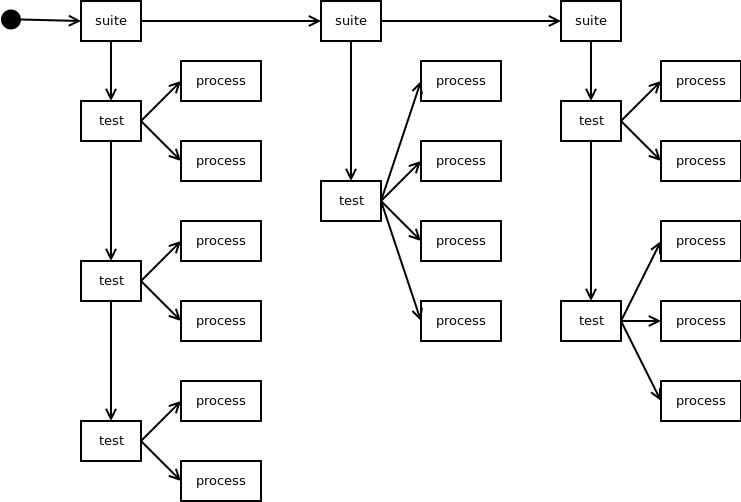
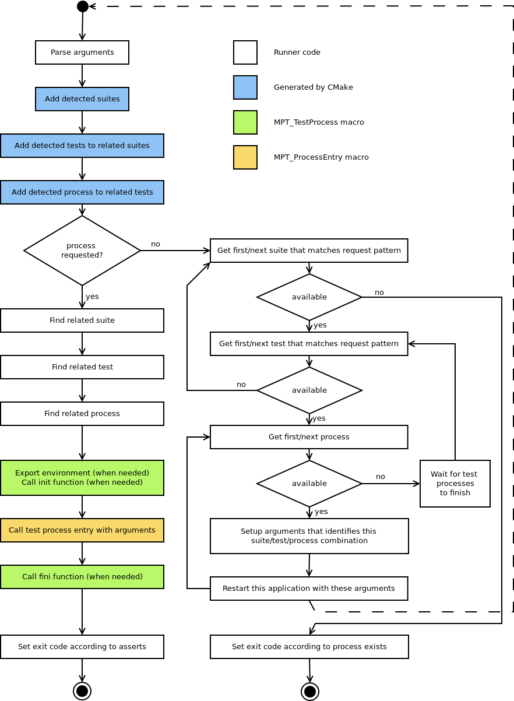

# Eclipse Cyclone DDS Multi Process Testing

Some features and functionalities of Cyclone DDS can only be tested when
there's communication between processes. Examples are durability, security,
etc. To really make sure that these kind of features work, extended tests
with multiple processes are needed.

This results in a number of [requirements](mpt_req.md).

There doesn't seem to be a 3rd party test framework that addresses our
requirements in a satisfactory manner. Therefore, it was decided to create
our own Multi Process Testing (MPT) framework.

This document will provide an overview of the MPT framework.


## Overview

An MPT application is basically divided into two components
1. Tests
2. Runner

The Tests are created by the developer. They don't need to worry about the
process management. They only have to provide process entry point(s), tests
and test processes that use these entry points. E.g.
```cpp
MPT_ProcessEntry(publisher, MPT_Args(int domain))
{
  /* Publish a sample on the given domain. */
  MPT_ASSERT(success, "publisher failed");
}
MPT_ProcessEntry(subscriber, MPT_Args(int domain))
{
  /* Subscribe to a sample from the given domain. */
  MPT_ASSERT(success, "subscriber failed");
}

MPT_TestProcess(helloworld, domain0, pub, publisher,  MPT_ArgValues(0));
MPT_TestProcess(helloworld, domain0, sub, subscriber, MPT_ArgValues(0));
MPT_Test(helloworld, domain0);

MPT_TestProcess(helloworld, domain42, pub, publisher,  MPT_ArgValues(42));
MPT_TestProcess(helloworld, domain42, sub, subscriber, MPT_ArgValues(42));
MPT_Test(helloworld, domain42);
```

There are more options, but see the
[usage test](../../src/mpt/tests/self/usage.c) for more elaborate examples.

CMake will identify suites, tests and processes depending on those MPT
macros.<br>
It'll use that to generate part of the MPT Runner. The Runner takes care
of starting test(s) and handling the process management.

The runner also takes care of preparing IPC between test processes so that
these processes can sync if they need to (NB, this will be a future extension).


#### Suite-Test-Process tree

A process is related to a test and that test is related to a suite.<br>
A suite can have multiple tests and tests can have multiple processes.<br>

This results in the following tree quite naturally.




#### Test execution

There are 3 main ways to start an MPT application.
1. Without argument.<br>
   All tests will be run.
2. With suite and/or test name patterns as arguments.<br>
   A subset of tests will be run depending on the provided patterns.<br>
   This allows ctest to execute single tests.
3. With a specific suite/test/process combination as arguments.<br>
   An user will normally not use this.

The third option is used by the MPT application itself to start a specific
test related process. It does so by restarting itself with the proper
suite/test/process combination as indicated by the test. This results
in the following flow.



