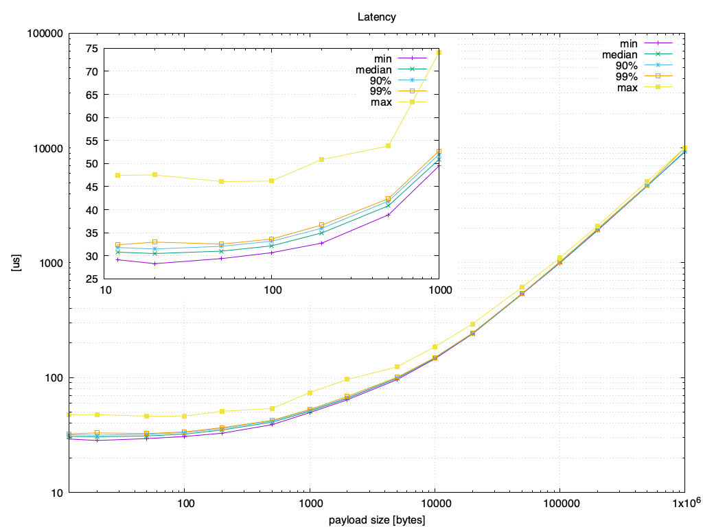

.. include:: ../external-links.part.rst

.. index:: Performance

################
Performance test
################

Reliable message throughput is over 1MS/s for very small samples and is roughly 90% 
of GbE with 100 byte samples. Latency is about 30us when measured using 
:ref:`dsperf_tool` between two Intel(R) Xeon(R) CPU E3-1270 V2 @ 3.50GHz
(2012 hardware) running Ubuntu 16.04, with the executables built on 
Ubuntu 18.04 using gcc 7.4.0 for a default (that is, "RelWithDebInfo") build.

The following show the performance of a reliable message:

.. image:: ../_static/gettingstarted-figures/throughput-async-listener-rate.png
   :scale: 50 %
   :alt: Throughput async listener rate

This is with the subscriber in listener mode, using asynchronous delivery for the 
throughput test. 

.. note::
    The configuration is a marginally tweaked out-of-the-box configuration: an 
    increased maximum message size and fragment size, and an increased high-water 
    mark for the reliability window on the writer side.

Test setup
==========

The details of the test setup can be found via the following links:

- |url::scripts|
- |url::environment_details|
- |url::throughput|

Test results
============

|url::latency| data underlying the graphs (including CPU usage):

.. image:: ../_static/gettingstarted-figures/throughput-async-listener-cpu.png
   :scale: 50 %
   :alt: Throughput async listener cpu

.. image:: ../_static/gettingstarted-figures/latency-sync-listener-bwcpu.png
   :scale: 50 %
   :alt: Latency sync listener bwcpu

.. image:: ../_static/gettingstarted-figures/throughput-async-listener-memory.png
   :scale: 50 %
   :alt: Throughput async listener memory
