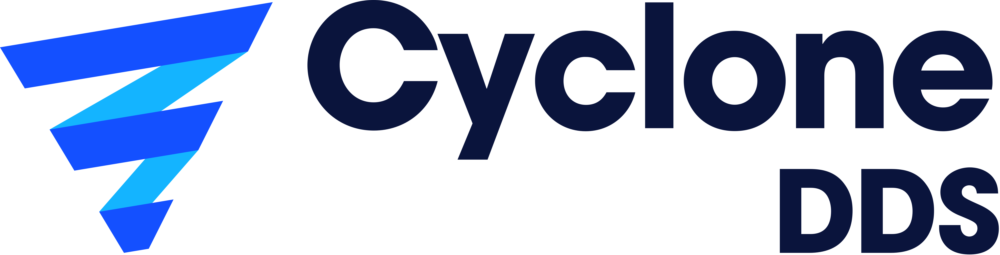

###############
Getting Started
###############

.. include:: ../external-links.part.rst

|url::logoimage|

|var-project| is a performant and robust OMG-compliant **Data Distribution Service** (DDS) implementation. The core of |var-project-short| is
implemented in C and provides C-APIs to applications. Through its C++ package, the |url::omg.org| 2003 language binding is also supported.

.. toctree::
   :maxdepth: 2
   :caption: Contents

   installation/installation
   c_tutorial/index
   cpp_tutorial/index
   py_tutorial/index
   installation/benchmarking
   contributing

.. include:: disclaimer.part.rst

