.. index:: Python; Command line tool

.. _py_cltools:

The ``cyclonedds`` command line tool
====================================

Included with the ``cyclonedds`` Python package is the ``cyclonedds`` command line tool. 

The command line tool provides a quick insight into what your DDS dataspace currently looks like. It allows you to verify that the public view of your applications matches what you had intended.

The following is a list of the ``cyclonedds`` subcommands:

* ``cyclonedds --help``: Shows the help for the ``cyclonedds`` subcommands.
* ``cyclonedds ls``: Shows the entities and their QoS settings in your DDS system.
* ``cyclonedds ps``: Lists the applications in your DDS system.
* ``cyclonedds typeof``: Shows the type(s) of a topic in your system.
* ``cyclonedds subscribe``: Dynamically subscribes to a topic and displays the data as it arrives.
* ``cyclonedds publish``: Dynamically builds a REPL with datatypes and a writer for a topic and displays the data as it arrives.
* ``cyclonedds performance``: A front-end to ``ddsperf`` with four modes: ``publish``, ``subscribe``, ``ping`` and ``pong``.

 The help screen shows the available commands:

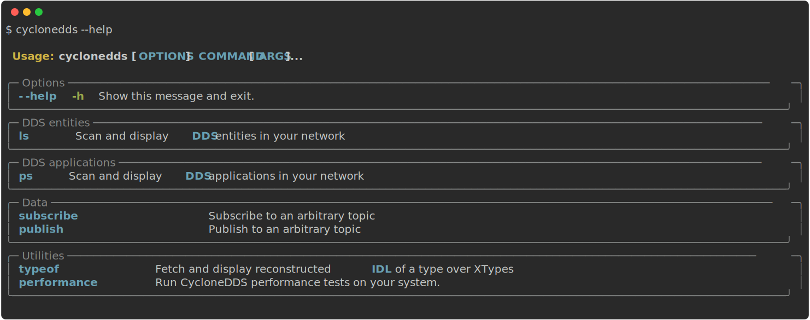

``cyclonedds ls``
-----------------

The ``ls`` subcommand shows the entities and their QoS settings in your DDS system.

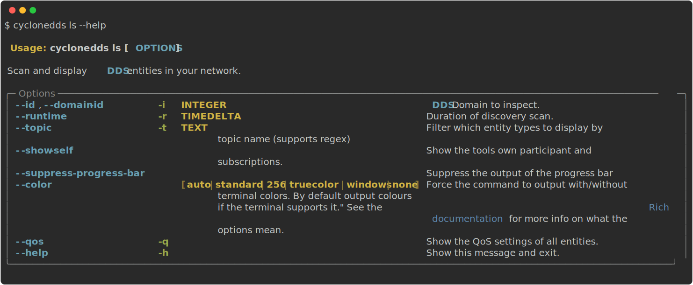

The following screen shows the output from ``cyclonedds ls``, while running the Python ``Vehicle`` example in the background:

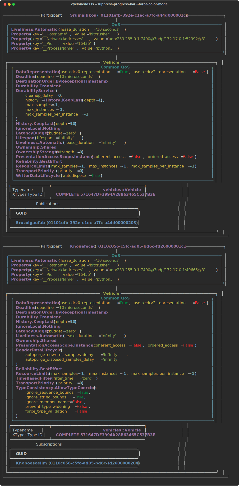

``cyclonedds ps``
-----------------

The ``ps`` subcommand lists the applications in your DDS system. Note: This depends on 'Participant Properties', which are known as "QoS properties" for DDS participants (merged into CycloneDDS version 0.10.0).

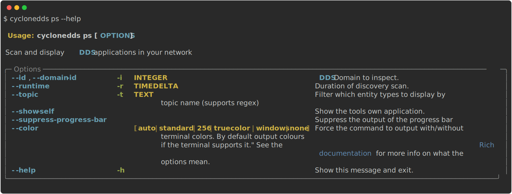

The following screen shows the output from ``cyclonedds ps``, while running the Python ``Vehicle`` example in the background:

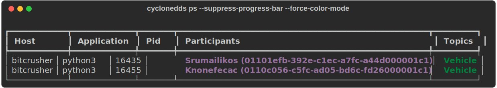

``cyclonedds typeof``
---------------------

The ``typeof`` subcommand shows the type(s) of a topic in your system. 

For XTypes, it is possible to have more than one type for each topic that exists, while maintaining compatability. The types are represented in IDL. For information on the XTypes specification, refer to: :ref:`https://www.omg.org/spec/DDS-XTypes/`_.

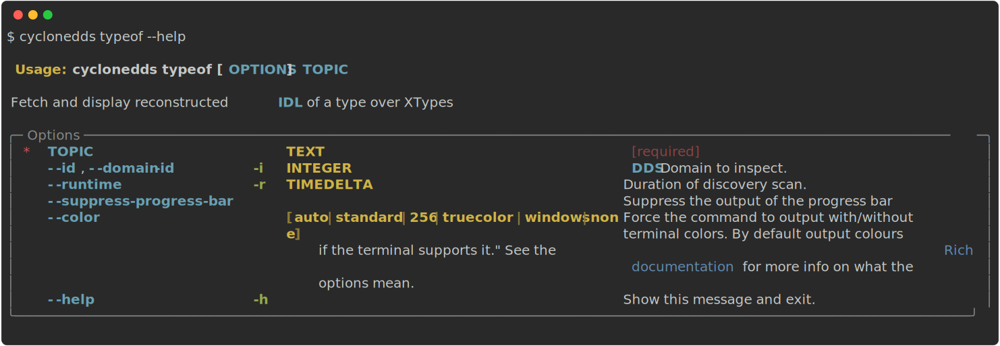

The following example screen shows the output from the ``Vehicle`` example:

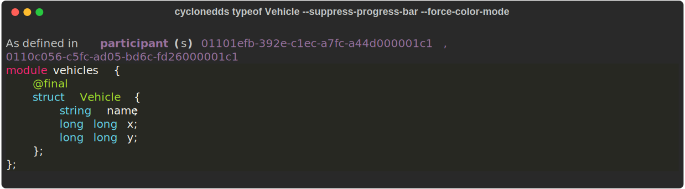

``cyclonedds subscribe``
------------------------

The ``subscribe`` subcommand dynamically subscribes to a topic and displays the data as it arrives. The type is discovered in a similar manner as ``typeof``.

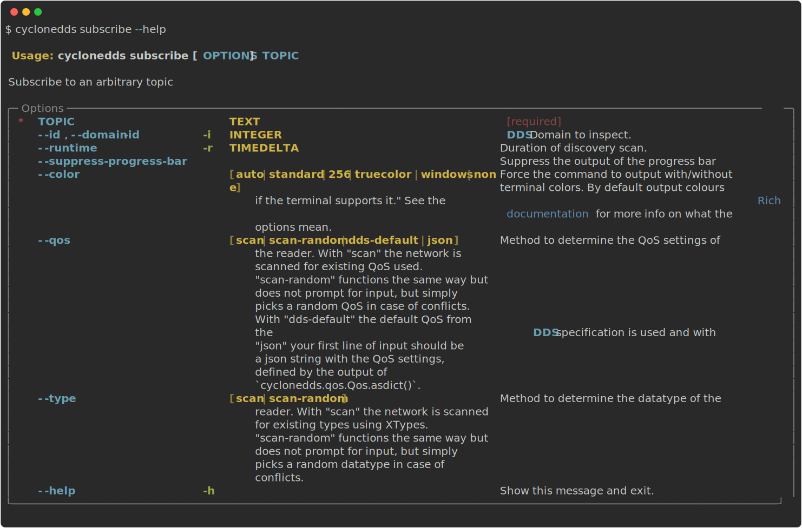

The following example screen shows the output from the ``Vehicle`` example:

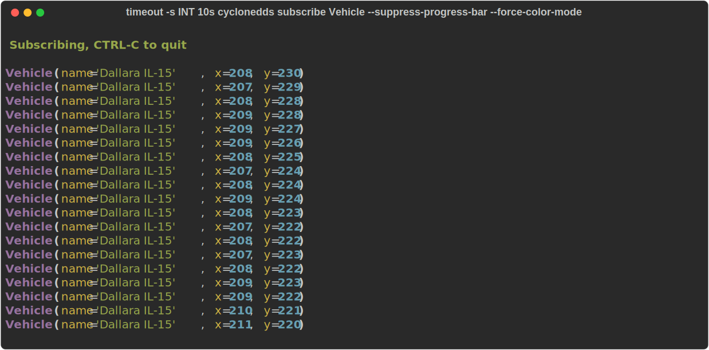

``cyclonedds publish``
------------------------

The ``publish`` subcommand dynamically builds a REPL with datatypes and a writer for a topic and displays the data as it arrives. The type is discovered in a similar manner as ``typeof``.

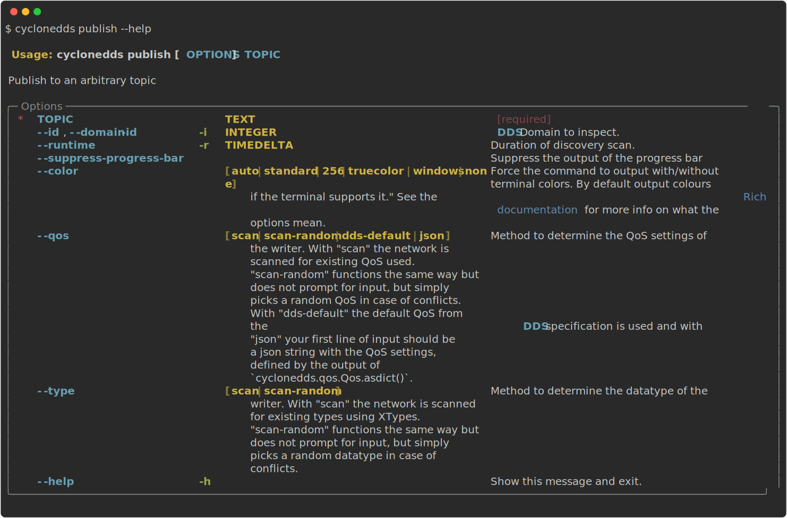

``cyclonedds performance``
--------------------------

The ``performance`` subcommand is a front-end to ``ddsperf`` with four modes: ``publish``, ``subscribe``, ``ping`` and ``pong``.

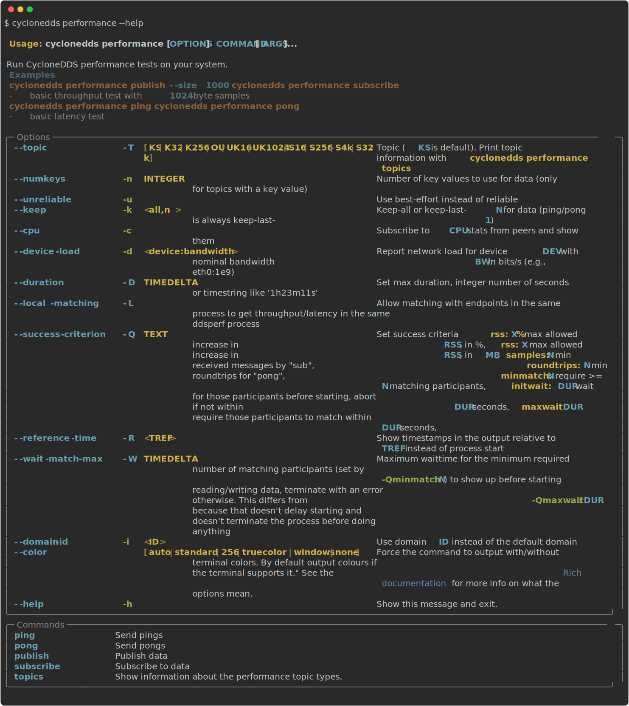

The following example screen shows a performance-run in the ``cyclonedds performance subscribe`` mode, rendered with ``cyclonedds performance publish`` running in the background.

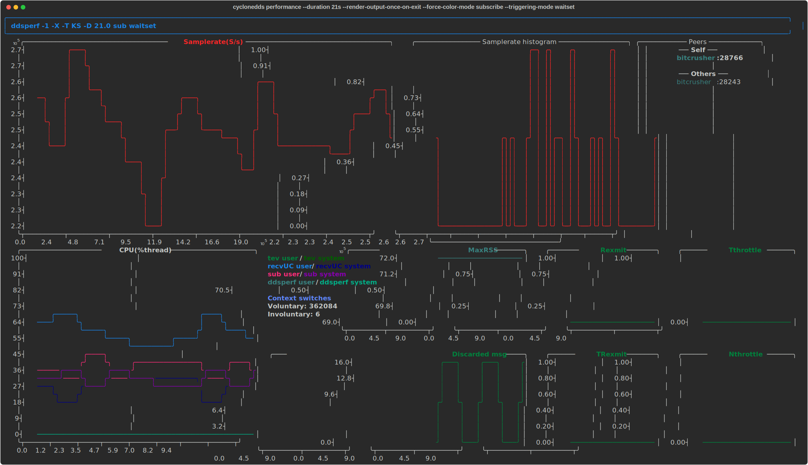