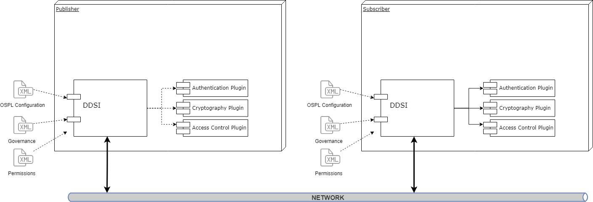
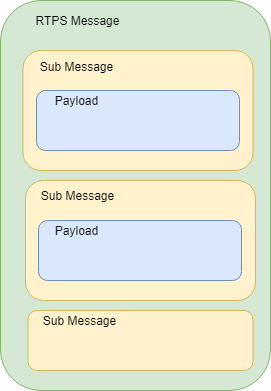

.. _`DDS Security`:

############
DDS Security
############

CycloneDDS is (will be) compliant with The Object Management Group (OMG) DDS Security specification.

This specification defines the Security Model and Service Plugin Interface (SPI) architecture for
compliant DDS implementations. The DDS Security Model is enforced by the invocation of these SPIs
by the DDS implementation.

The three plugins that comprise the DDS Security Model in CycloneDDS are:

**Authentication Service Plugin**

Provides the means to verify the identity of the application and/or user that invokes operations
on DDS. Includes facilities to perform mutual authentication between participants and establish
a shared secret.

**AccessControl Service Plugin**

Provides the means to enforce policy decisions on what DDS related operations an authenticated
user can perform. For example, which domains it can join, which Topics it can publish or
subscribe to, etc.

**Cryptographic Service Plugin**

Implements (or interfaces with libraries that implement) all cryptographic operations including
encryption, decryption, hashing, digital signatures, etc. This includes the means to derive keys
from a shared secret.

----

CycloneDDS provides built-in implementations of these plugins. Authentication uses PKI
(Public Key Infrastructure) with a pre-configured shared Certificate Authority, RSA is used for
authentication and Diffie-Hellman is used for key exchange. AccessControl use Permissions document
signed by shared Certificate Authority. Cryptography uses AES-GCM (AES using Galois Counter Mode)
for encryption and AES-GMAC for message authentication.

The plugins are accessed by the DDSI2 service when DDS Security is enabled by supplying the
security configuration within the XML configuration or Participant QoS.

Security plugins are dynamically loaded where the locations are defined in CycloneDDS
configuration or Participant QoS settings.

*******************************************************
Brief information about PKI (public key infrastructure)
*******************************************************

The comprehensive system required to provide public-key encryption and digital signature services
is known as a public-key infrastructure (PKI). The purpose of a PKI is to manage keys and
certificates. By managing keys and certificates through a PKI, an organization establishes and
maintains a trustworthy networking environment.

Public Key Cryptography: Each user has a key pair, generated during the initial certificate
deployment process, that is comprised of a public key, which is shared, and a private key, which
is not shared. Data is encrypted with the user’s public key and decrypted with their private key.
Digital signatures, used for non-repudiation, authentication and data integrity, are also generated
using public key cryptography.

**Identity Certificate**

This is an electronic document used to prove the ownership of a public key. The certificate
includes information about the key, information about the identity of its owner (called the
subject), and the digital signature of an entity that has verified the certificate's contents
(called the issuer). If the signature is valid, and the software examining the certificate
trusts the issuer, then it can use that key to communicate securely with the certificate's
subject.

**Certificate Authority**

This issues user certificates and acts as the chief agent of trust.  When issuing a certificate
to a user, the CA signs the certificate with its private key in order to validate it. During
electronic transactions the CA also confirms that certificates are still valid. Certificates
may be revoked for various reasons. For example, a user may leave the organization or they may
forget their secret passphrase, the certificate may expire or become corrupt. This process is
usually accomplished through the use of a Certificate Revocation List (CRL) which is a list of
the certificates that have been revoked. Only the certificates that have been revoked appear on
this list.

**Subject of Identity Certificate**

This is the identity to be secured. It contains information such as common name (CN),
organization (OU), state (ST) and country (C).

**Subject Name**

This is aka distinguished name and is the string representation of certificate subject.

ie: emailAddress=alice\@adlink.ist,CN=Alice,OU=IST,O=ADLink,ST=OV,C=NL

*************************
PKI Usage in DDS Security
*************************

.. image:: ./_static/pictures/pki_overview.png
   :width: 1000

Alice and Bob are the DDS participants who have their private and public keys. Identitity
Certificate Authority (ID CA) has its own self-signed certificate (IdentityCA in the diagram).
ID CA gets Alice's subject information and public key and generates an IdentityCertificate for her.
Alice's certificate includes her public key and certificate of ID CA; so that her certificate can
be verified if it is really issued by ID CA.

Access Control is configured with governance and permissions files.
Governance file defines the security behavior of domains and topics.
Permissions file contains the permissions of the domain participant, topics, readers and writers,
binds them to identity certificate by subject name (distinguished name).

Governance files and Permissions files are signed by Permission CA. Signed documents also
contains Permissions CA certificate; so that they can be verified if they are really issued
by Permissions CA.

Authenticated participants handshakes with each other and generates a shared key by Diffie-Hellman
key exchange. This shared key is used for encrypting/decrypting data with AES.

During the handshake Alice checks Bob's certificate and Bob's Permissions file if they are really
issued by the ID CA certificate and Permissions CA Certificate that **she** has. Also Bob checks
Alice's certificate and Alice's Permissions file if they are really issued by the ID CA certificate
and Permissions CA that **he** has.
Permissions file can contain  permissions for several identities; so subject name of identity
certificate exist in permissions file to establish a binding between identity and its permissions.

*************
Configuration
*************

.. image:: ./_static/pictures/dds_security_configuration_overview.png
   :width: 1000

The configuration of DDS Security is split up into two parts.

- `Plugins Configuration`_
- `Access Control Configuration`_

This section explains the configuration in details. However, you can see a concrete example on
security section of Example Readme file.

.. _`Plugins Configuration`:

Plugins Configuration
*********************

TODO: Update to reflect the configuration through QoS policies.

| CyclonDDS gets the plugin configuration from DDS2I configuration elements or the Participant QoS
  Policies as stated in the DDS Security specification.

| This behavior allows applications to use DDS Security without update. Only supplying a new
  configuration with DDS Security enabled is enough to switch from a non-secure to a secure
  deployment. However, the same DDS Security configuration is forced upon all the participants
  within the federation.

| The configuration options are bundled in the ``DDSSecurity`` configuration section in DDS2I.

| Every DDS Security plugin has its own configuration sub-section.

.. _`Authentication Properties`:

=========================
Authentication Properties
=========================

| To authenticate CycloneDDS, it has to be configured with IdentityCertificate
  (DDSSecurity/Authentication/IdentityCertificate - see Configuration Guide - DDS Security).
  This IdentityCertificate is used to authenticate all participants of that particular
  CycloneDDS domain.

| Associated with the IdentityCertificate is the corresponding PrivateKey
  (DDSSecurity/Authentication/PrivateKey).
  The PrivateKey may either be a 2048-bit RSA or a 256-bit Elliptic Curve Key with
  a prime256v1 curve.

| IdentityCA (DDSSecurity/Authentication/IdentityCA) is the certificate of Identity Certificate
  Authority (CA) which is the issuer of the IdentityCertificate.  The public key of the
  IdentityCA shall either be a 2048-bit RSA key or a 256-bit Elliptic Curve Key for the prime256v1
  curve. The identity_ca can be a self-signed certificate.

| Currently the IdentityCertificate, IdentityCA and PrivateKey should be a X509 document in pem
  format.
  It may either be specified directly in the configuration file or the configuration file should
  contain a reference to a corresponding file.

| Optionally the PrivateKey could be protected by a password (DDSSecurity/Authentication/Password).

| Furthermore the CycloneDDS configuration allows to configure a directory containing additional
  IdentityCA's
  which are used to verify the identity certificates that are received by remote instances
  (DDSSecurity/Authentication/TrustedCADirectory). This option allows to use more than one identity
  CA throughout the system. TrustedCADirectory is an extension to DDS Security specification; so it
  can not be used when communicating with other vendors.

.. _`Access Control Properties`:

=========================
Access Control Properties
=========================

Governance Document (DDSSecurity/AccessControl/Governance),
Permissions Document (DDSSecurity/AccessControl/Permissions) and
Permissions CA Certificate (DDSSecurity/AccessControl/PermissionsCA) are required for access
control plugin. See DDS Security section of Configuration Guide for property descriptions. They
can be provided by data itself (with CDATA) or path to file on disk.

.. _`Cryptography Properties`:

=======================
Cryptography Properties
=======================

Cryptography plugin has no property

.. _`Access Control Configuration`:

Access Control Configuration
****************************

| Access Control configuration consists of Governance document and Permissions document.
  Both governance and permissions files must be signed by the Permissions CA in S/MIME format.
  Participants use their own permissions CA to validate remote permissions. So, all permissions CA
  Certificates must be same for all participants.

| The signed document should use S/MIME version 3.2 format as defined in IETF RFC 5761 using
  SignedData Content Type (section 2.4.2 of IETF RFC 5761) formatted as multipart/signed (section
  3.4.3 of IETF RFC 5761). This corresponds to the mime-type application/pkcs7-signature.
  Additionally the signer certificate should be be included within the signature.

===================
Governance Document
===================

Governance document defines the security behavior of domains and topics. It is an XML document and
its format is specified in OMG DDS Security Version 1.1 Section 9.4.1.2.3

The attributes that specified in Governance document must match with the remote one for
establishing communication.

Protection Kinds
================

The domain governance document provides a means for the application to configure the kinds of
cryptographic transformation applied to the complete RTPS Message, certain RTPS SubMessages, and
the SerializedPayload RTPS submessage element that appears within the Data.

The configuration allows specification of five protection levels: NONE, SIGN, ENCRYPT,
SIGN_WITH_ORIGIN_AUTHENTICATION and ENCRYPT_WITH_ORIGIN_AUTHENTICATION.

**NONE**
  indicates no cryptographic transformation is applied.

**SIGN**
  indicates the cryptographic transformation shall be purely a message authentication code (MAC),
  that is, no encryption is performed.

**ENCRYPT**
  indicates the cryptographic transformation shall be an encryption followed by a message
  authentication code (MAC) computed on the ciphertext, also known as Encrypt-then-MAC.

**SIGN_WITH_ORIGIN_AUTHENTICATION**
  indicates the cryptographic transformation shall be purely a set of message authentication codes
  (MAC), that is, no encryption is performed. This cryptographic transformation shall create a
  first “common authenticationcode” similar to the case where Protection Kind is SIGN. In addition
  the cryptographic transformation shall create additional authentication codes, each produced with
  a different secret key. The additional MACs prove to the receiver that the sender originated the
  message, preventing other receivers from impersonating the sender.

**ENCRYPT_WITH_ORIGIN_AUTHENTICATION**
  indicates the cryptographic transformation shall be an encryption followed by a message
  authentication code (MAC) computed on the ciphertext, followed by additional authentication
  codes, Each of the additional authentication codes shall use a different secret key. The
  encryption and first (common) authentication code is similar to ones produced when the Protection
  Kind is ENCRYPT. The additional authentication codes are similar to the ones produced when the
  Protection Kind is SIGN_WITH_ORIGIN_AUTHENTICATION.

Participant attributes
======================

**Allow Unauthenticated Participants**
  This is used for allowing communication with non-secure participants. If this option is enabled,
  secure participant can communicate with non-secure participant by only non-protected topics.

**Enable Join Access Control**
  If this option is enabled, remote participant permissions are checked if its subject name is
  allowed to create a topic anyhow.

**Discovery Protection Kind**
  Protection attribute for discovery communication when it is enabled for topic. Please see the
  DDS Security specification document for available options.

**Liveliness Protection Kind**
  Protection attribute for liveliness communication when it is enabled for topic. Please see the
  DDS Security specification document for available options.

**RTPS Protection Kind**
  Protection attribute for all messages on the wire. Please see the DDS Security specification
  document for available options. If encryption is selected for RTPS, there is no need to encrypt
  submessages (metadata_protection_kind) and payloads (data_protection_kind) which are defined in
  topic settings.

Topic Attributes
================

**Enable Discovery protection:**
  If enabled, discovery is protected according to Discovery Protection Kind attribute of
  corresponding participant.

**Enable Liveliness protection:**
  If enabled, liveliness is protected according to Liveliness Protection Kind attribute of
  corresponding participant.

**Enable Read Access Control:**
  If enabled, the permissions document is checked if the participant is allowed to create
  a datareader for the related topic.

**Enable Write Access Control:**
  If enabled, the permissions document is checked if the participant is allowed to create
  a datawriter for the related topic.

**Metadata protection Kind:**
  Protection attribute for submessages.

**Data protection Kind:**
  Protection attribute for data payload.

There are different settings for different domain ranges. The domain rules are evaluated in the
same order as they appear in the document. A rule only applies to a particular DomainParticipant
if the domain Section matches the DDS domain_id to
which the DomainParticipant belongs. If multiple rules match, the first rule that matches is the
only one that applies.

The topic access rules are evaluated in the same order as they appear within the
<topic_access_rules> Section. If multiple rules match the first rule that matches is the only one
that applies.

fnmatch pattern matching can be used for topic expressions including the following patterns

.. _`fnmatch pattern matching`:

+----------+----------------------------------+
|Pattern   |Meaning                           |
+==========+==================================+
| \*       | matches everything               |
+----------+----------------------------------+
| \?       | matches any single character     |
+----------+----------------------------------+
| [seq]    | matches any character in seq     |
+----------+----------------------------------+
| [!seq]   | matches any character not in seq |
+----------+----------------------------------+

====================
Permissions Document
====================

The permissions document is an XML document containing the permissions of the domain participant
and binding them to the subject name of the DomainParticipant as defined in the identity
certificate. Its format is specified in OMG DDS Security Version 1.1 Section 9.4.1.3.

Validity period
===============

It is checked before creating participant; expired permissions document results with DDSI shutdown.
Validity period is also checked during handshake with remote participant; expired remote
permissions document prevents communications to be established.

Subject Name
============

The subject name must match with Identity Certificate subject. It is checked during create
participant and during handshake with remote participant. Use the following openssl command to get
subject name from identity certificate:

``openssl x509 -noout -subject -nameopt RFC2253 -in <identity_certificate_file.crt>``

Rules
=====

DomainParticipant permissions are defined by set of rules.

The rules are applied in the same order that appear in the document. If the criteria for the rule
matches the domain_id join and/or publish or subscribe operation that is being attempted, then the
allow or deny decision is applied. If the criteria for a rule does not match the operation being
attempted, the evaluation shall proceed to the next rule. If all rules have been examined without
a match, then the decision specified by the “default” rule is applied. The default rule, if
present, must appear after all allow and deny rules. If the default rule is not present, the
implied default decision is DENY. The matching criteria for each rule specify the domain_id,
topics (published and subscribed), the partitions (published and subscribed), and the data-tags
associated with the DataWriter and DataReader.

For the grant to match there shall be a match of the topics, partitions, and data-tags criteria.
This is interpreted as an AND of each of the criteria. For a specific criterion to match
(e.g., <topics>) it is enough that one of the topic expressions listed matches (i.e., an OR of
the expressions with the <topics> section).

`fnmatch pattern matching`_ can be used for topic expressions and partition expressions.

Interactions with DDS Security
******************************

DDS Security provides the responses through CycloneDDS error and info log. Users can get
messages for:

- Configuration errors such as plugin library files, certificate files, governance and permissions
  files that can not be found on filesystem.
- Permission errors such as denied permission for creating writer of a topic.
- Attribute mismatch errors such as mismatches of security attributes between participants, topics,
  readers and writers.
- Integrity errors such as Permissions file-Permissions CA and Identity Cert-Identity CA integrity.

Local subscription, publication and topic permission errors are written to error log.
Remote participation, subscription and publication permission errors are written to info log as
warning message.

Data Communication And Handshake Process
*******************************************

Authentication handshake between participants starts after participant discovery.
If a reader and a writer created during that period, their match will be delayed until after the
handshake succeeds.
This means, during the handshake process, volatile data will be lost, just like there is no reader.

After publication match, the encryption / decryption keys are exchanged between reader and writer.
Best-effort data that are sent during this exchange will be lost, however reliable data will be
resent.

DDS Secure Discovery
******************************

Just like normal operation, DDSI will discover local and remote participants, topics, readers and
writers.
However, when DDS Security is enabled, it is more complex and will take a longer time (especially
due to the handshaking that has to happen).

With every new node in the system, the discovery takes exponentially longer. This can become a
problem if the system contains a number of slow platforms or is large.

The Security discovery performance can be increased quite a bit by using the DDSI
Internal/SquashParticipants configuration.

Proprietary builtin endpoints
******************************

| The DDS standard contains some builtin endpoints. A few are added by the DDS Security
  specification. The behaviour of all these builtin endpoints are specified (and thus are be
  handled by the plugins that implement the DDS Security specification), meaning that they
  don't have to be present in the Governance or Permissions documents and the users don't
  have to be bothered with them.
|
| A few of these builtin endpoints slave according to the <discovery_protection_kind> within
  the Governance document. In short, related submessages are protected according to the value
  of <discovery_protection_kind>. This protects meta information that is send during the
  discovery phase.

*******************
DataTag Permissions
*******************

| Data Tags provide an extra (optional) level of identification. This can mean f.i. that
  a certain reader is not allowed to read data from writer A but it is allowed to read from
  writer B (all the same topic).
|
| This optional feature is not yet supported.

***************************
External Plugin Development
***************************

DDS Security consists of three plugins (authentication, cryptography and access control).
CycloneDDS comes with built-in security plugins that comply with OMG DDS Security specification.
The plugins are loaded in the run-time. However, you can also implement your own custom plugin by
implementing the given API according to OMG DDS Security specification.
You can implement all of the plugins or just one of them.

| The followings are the key points for implementing you own plugin:

Interface
*********

Implement all plugin specific functions with exactly same prototype. Plugin specific function
interfaces are in dds_security_api_access_control.h, dds_security_api_authentication.h and
dds_security_api_cryptography.h header files accordingly.

Init and Finalize
*****************

| A plugin should have an init and a finalize functions. plugin_init and plugin_finalize
  interfaces are given in dds_security_api.h header file and function should be same as in
  configuration file.
| Init function is called once, just after the plugin is loaded. Finalize function is
  called once, just before the plugin is unloaded.

Inter Plugin Communication
**************************

| There is a shared object (*DDS_Security_SharedSecretHandle*) within authentication and
  cryptography plugins. If you want to implement only one of them and use the builtin for the
  other one, you have to get or provide the shared object properly.
| *DDS_Security_SharedSecretHandle* is the integer representation of
  *DDS_Security_SharedSecretHandleImpl* struct object. Cryptography plugin gets the
  *DDS_Security_SharedSecretHandle* from authentication plugin and casts to
  *DDS_Security_SharedSecretHandleImpl* struct. Then all needed information can be retieved
  through *DDS_Security_SharedSecretHandleImpl* struct:

::

  typedef struct DDS_Security_SharedSecretHandleImpl {
   DDS_Security_octet* shared_secret;
   DDS_Security_long shared_secret_size;
   DDS_Security_octet challenge1[DDS_SECURITY_AUTHENTICATION_CHALLENGE_SIZE];
   DDS_Security_octet challenge2[DDS_SECURITY_AUTHENTICATION_CHALLENGE_SIZE];

  } DDS_Security_SharedSecretHandleImpl;

Error Codes
***********

| Most of the plugin functions have parameter for reporting exception. The following exception
  codes should be used in the reported exception data according to the situation.
  dds_security_api_err.h header file contains the code and message constants.

+-------+----------------------------------------------------------------+
| Code  |            Message                                             |
+=======+================================================================+
| 0     | (OK)                                                           |
+-------+----------------------------------------------------------------+
| 100   | Can not generate random data                                   |
+-------+----------------------------------------------------------------+
| 110   | Identity empty                                                 |
+-------+----------------------------------------------------------------+
| 111   | Participant Crypto Handle empty                                |
+-------+----------------------------------------------------------------+
| 112   | Permission Handle empty                                        |
+-------+----------------------------------------------------------------+
| 113   | Invalid Crypto Handle                                          |
+-------+----------------------------------------------------------------+
| 114   | Invalid argument                                               |
+-------+----------------------------------------------------------------+
| 115   | Invalid Crypto token                                           |
+-------+----------------------------------------------------------------+
| 116   | Invalid parameter                                              |
+-------+----------------------------------------------------------------+
| 117   | File could not be found, opened or is empty, path: %s          |
+-------+----------------------------------------------------------------+
| 118   | Unknown or unexpected transformation kind                      |
+-------+----------------------------------------------------------------+
| 119   | Message cannot be authenticated, incorrect signature           |
+-------+----------------------------------------------------------------+
| 120   | Can not open trusted CA directory                              |
+-------+----------------------------------------------------------------+
| 121   | Identity CA is not trusted                                     |
+-------+----------------------------------------------------------------+
| 122   | Certificate start date is in the future                        |
+-------+----------------------------------------------------------------+
| 123   | Certificate expired                                            |
+-------+----------------------------------------------------------------+
| 125   | Certificate authentication algorithm unknown                   |
+-------+----------------------------------------------------------------+
| 126   | Failed to allocate internal structure                          |
+-------+----------------------------------------------------------------+
| 127   | Failed to parse PKCS7 SMIME document                           |
+-------+----------------------------------------------------------------+
| 128   | Property is missing: (%s)                                      |
+-------+----------------------------------------------------------------+
| 129   | Permissions document is invalid                                |
+-------+----------------------------------------------------------------+
| 130   | Governance document is invalid                                 |
+-------+----------------------------------------------------------------+
| 131   | Operation is not permitted in this state                       |
+-------+----------------------------------------------------------------+
| 132   | Remote permissions document is not available                   |
+-------+----------------------------------------------------------------+
| 133   | Certificate is invalid                                         |
+-------+----------------------------------------------------------------+
| 134   | Certificate type is not supported                              |
+-------+----------------------------------------------------------------+
| 135   | Governance property is required                                |
+-------+----------------------------------------------------------------+
| 136   | Permissions CA property is required                            |
+-------+----------------------------------------------------------------+
| 137   | Can not parse governance file                                  |
+-------+----------------------------------------------------------------+
| 138   | Can not parse permissions file                                 |
+-------+----------------------------------------------------------------+
| 139   | Could not find permissions for topic                           |
+-------+----------------------------------------------------------------+
| 140   | Could not find domain %d in permissions                        |
+-------+----------------------------------------------------------------+
| 141   | Could not find domain %d in governance                         |
+-------+----------------------------------------------------------------+
| 142   | Could not find %s topic attributes for domain(%d) in governance|
+-------+----------------------------------------------------------------+
| 143   | PluginClass in remote token is incompatible                    |
+-------+----------------------------------------------------------------+
| 144   | MajorVersion in remote token is incompatible                   |
+-------+----------------------------------------------------------------+
| 145   | Access denied by access control                                |
+-------+----------------------------------------------------------------+
| 146   | Subject name is invalid                                        |
+-------+----------------------------------------------------------------+
| 147   | Permissions validity period expired for %s                     |
+-------+----------------------------------------------------------------+
| 148   | Permissions validity period has not started yet for %s         |
+-------+----------------------------------------------------------------+
| 149   | Could not find valid grant in permissions                      |
+-------+----------------------------------------------------------------+
| 150   | Permissions of subject (%s) outside validity date: %s - %s     |
+-------+----------------------------------------------------------------+
| 151   | Unsupported URI type: %s                                       |
+-------+----------------------------------------------------------------+

.. EoF
