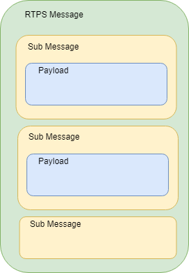

.. include:: ../external-links.part.rst

.. index:: Access control; Configuration

.. _`Access_Control_Configuration`:

Access control configuration
****************************

Access Control configuration consists of a `governance document`_ and a `permissions document`_.
Both documents must be signed by the Permissions CA in S/MIME format.
To validate remote permissions, Participants use their own permissions CA. 

.. note::
  All permissions CA Certificates must be the same for all participants.

The signed document must be formatted as follows:

- S/MIME version 3.2 format (as defined in |url::rfc5751_link|).
- SignedData Content Type (|url::rfc5751_2-4-2_link|). 
- Signing Using the multipart/signed Format (|url::rfc5751_3-4-3_link|).

This corresponds to the mime-type application/pkcs7-signature.

.. note:: 
  The signer certificate should be be included within the signature.

.. index:: ! Governance document

.. _`governance_document`:

===================
Governance document
===================

The governance document is an XML file that defines the security behavior of domains and topics. 
It is specified in OMG |url::omg.security| (Version 1.1 Section 9.4.1.2.3). For an example of a 
governance document, see :ref:`create_governance_document`. 

.. note::
  To establish communication with a remote node, the options that are specified in a governance 
  document must match with those in the remote node.

.. index:: Protection kinds

Protection kinds
================

The domain governance document provides a means for the application to configure the kinds of
cryptographic transformation applied to the complete :term:`RTPS` message, certain RTPS submessages, and
the SerializedPayload RTPS submessage element that appears within the data.

The configuration allows specification of five protection levels: 

- **NONE**

  Indicates that no cryptographic transformation is applied.

- **SIGN**

  Indicates that the cryptographic transformation is a :term:`MAC`, that is, 
  there is no encryption.

- **ENCRYPT**

  Indicates that the cryptographic transformation is an encryption, followed by a MAC 
  computed on the ciphertext, also known as Encrypt-then-MAC.

- **SIGN_WITH_ORIGIN_AUTHENTICATION**

  Indicates that the cryptographic transformation is a set of MACs, that is, no 
  encryption is performed. This cryptographic transformation creates a first common 
  ``authenticationcode`` (similar to where the Protection Kind is **SIGN**). The 
  cryptographic transformation creates additional authentication codes, each produced 
  with a different secret key. The additional MACs prove to the receiver that the sender 
  originated the message, preventing other receivers from impersonating the sender.

- **ENCRYPT_WITH_ORIGIN_AUTHENTICATION**.

  Indicates that the cryptographic transformation is an encryption, followed by a MAC 
  computed on the ciphertext, followed by additional authentication codes. Each of the 
  additional authentication codes use a different secret key. The encryption and first 
  (common) authentication code is similar to ones produced when the Protection Kind is 
  **ENCRYPT**. The additional authentication codes are similar to the ones produced when the
  Protection Kind is **SIGN_WITH_ORIGIN_AUTHENTICATION**.

.. index:: Participant attributes

Participant attributes
======================

- **Allow Unauthenticated Participants**
  
  For communication with non-secure participants. 
  If this option is enabled, a secure participant can only communicate with a non-secure 
  participant via non-protected topics.

- **Enable Join Access Control**
  
  If this option is enabled, remote participant permissions 
  are checked to see if its subject name is allowed to create a topic.

- **Discovery Protection Kind**
  
  This is the protection attribute for discovery communication 
  when it is enabled for topic. For available options, refer to the OMG |url::omg.security| 
  specification.

- **Liveliness Protection Kind**
  
  Protection attribute for liveliness communication when 
  it is enabled for topic. For available options, refer to the OMG |url::omg.security| 
  specification.

- **RTPS Protection Kind**
  
  Protection attribute for all messages on the wire. For available 
  options, refer to the OMG |url::omg.security| specification. If encryption is selected for 
  RTPS, there is no need to encrypt submessages (metadata_protection_kind) and payloads 
  (data_protection_kind) which are defined in topic settings.

Topic attributes
================

- **Enable Discovery protection** 

  If enabled, discovery is protected according to Discovery 
  Protection Kind attribute of the corresponding participant.

- **Enable Liveliness protection** 

  If enabled, liveliness is protected according to Liveliness 
  Protection Kind attribute of the corresponding participant.

- **Enable Read Access Control** 

  If enabled, the permissions document is checked if the 
  participant is allowed to create a datareader for the related topic.

- **Enable Write Access Control** 

  If enabled, the permissions document is checked if the 
  participant is allowed to create a datawriter for the related topic.

- **Metadata protection Kind** 

  Protection attribute for submessages.

- **Data protection Kind**
  
  Protection attribute for data payload.

There are different settings for different domain ranges. The domain rules are evaluated in the
same order as they appear in the document. A rule only applies to a particular ``DomainParticipant``
if the domain Section matches the DDS ``domain_id`` to which the participant belongs. If multiple
rules match, the first rule that matches is the only one that applies.

.. Where is the <topic_access_rules> Section?

The topic access rules are evaluated in the same order as they appear within the
<topic_access_rules> Section. If multiple rules match the first rule that matches is the only one
that applies.

fnmatch pattern matching can be used for topic expressions including the following patterns:

.. index:: fnmatch pattern matching

.. _`fnmatch pattern matching`:

+---------+----------------------------------+
| Pattern | Meaning                          |
+=========+==================================+
| \*      | matches everything               |
+---------+----------------------------------+
| \?      | matches any single character     |
+---------+----------------------------------+
| [seq]   | matches any character in seq     |
+---------+----------------------------------+
| [!seq]  | matches any character not in seq |
+---------+----------------------------------+

.. index:: Permissions document

.. _`permissions_document`:

====================
Permissions document
====================

The permissions document is an XML file that contains the permissions of the domain participant
and binds them to the subject name of the ``DomainParticipant``. It is specified in OMG 
|url::omg.security| (Version 1.1 Section 9.4.1.3).

For an example of a permissions document, refer to: :ref:`create_permissions_document`.

.. index:: Validity period

Validity period
===============

The validity period is checked before creating a participant. The validity period is also 
checked during handshake with a remote participant. 

.. note::
  An expired remote permissions document prevents communications from being established.

.. index:: Subject name

Subject name
============

The subject name must match with Identity Certificate subject. It is checked during a create
participant, and during handshake with a remote participant. Use the following openssl command to get
subject name from identity certificate:

 ``openssl x509 -noout -subject -nameopt RFC2253 -in <identity_certificate_file.pem>``

.. index:: Security; Participant permissions rules

Participant permissions rules
=============================

Participant permissions are defined by set of rules. The rules are applied in the same order
that appear in the document.

If the criteria for the rule matches the domain_id join and/or publish or subscribe operation 
that is being attempted, then the allow or deny decision is applied.

If the criteria for a rule does not match the operation being attempted, the evaluation shall 
proceed to the next rule. 
  
If all rules have been examined without a match, then the decision specified by the “default” 
rule is applied. The default rule, if present, must appear after all allow and deny rules. 
If the default rule is not present, the implied default decision is DENY. 
  
The matching criteria for each rule specify the ``domain_id``, topics (published and subscribed), 
the partitions (published and subscribed), and the data-tags associated with the DataWriter 
and DataReader.

For the grant to match, there must be a match of the topics, partitions, and data-tags criteria.
This is interpreted as an *AND* of each of the criteria. For a specific criterion to match
(for example, <Topics>) it is enough that one of the topic expressions listed matches (that is, 
an *OR* of the expressions with the <Topics> section).

For topic expressions and partition expressions, use `fnmatch pattern matching`_.
