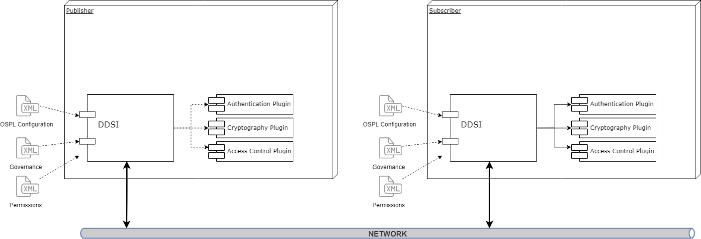

.. include:: ../external-links.part.rst

.. index:: ! DDS security, ! Security
  single: Plugin; Security

.. _DDS_security:

############
DDS security
############

.. toctree::
    :maxdepth: 1
    :hidden:
    
    public_key_infrastructure
    dds_security_config
    logging_tracing
    data_comms_handshake
    dds_secure_discovery
    proprietary_builtin_endpoints
    example_configuration
    external_plugin_dev
    error_codes

|var-project-short| is compliant with The Object Management Group (OMG) |url::omg.security| 
specification, which defines the Security Model and :term:`SPI` architecture for compliant 
DDS implementations. The DDS Security Model is enforced by the invocation of these SPIs
by the DDS implementation.

The DDS Security Model has the following three |var-project-short| plugins:

- **Authentication service plugin**

  Verifies the identity of the application and/or user that invokes operations on DDS. Includes 
  facilities for mutual authentication between participants and establish a shared secret.

- **AccessControl service plugin**

  Enforces policy decisions that determine what DDS-related operations an authenticated user is 
  permitted to do. For example, which domains it can join, which topics it can publish or subscribe 
  to, and so on.

- **Cryptographic service plugin**

  Implements (or interfaces with libraries that implement) all cryptographic operations. Includes
  encryption, decryption, hashing, digital signatures, and so on (also includes the means to derive keys
  from a shared secret).

|var-project-short| provides built-in implementations of these plugins. Authentication uses :term:`PKI`
with a pre-configured shared :ref:`Certificate Authority <certificate_authority>`. :term:`RSA` is for 
authentication and Diffie-Hellman is for key exchange. The AccessControl service plugin uses a 
Permissions document that is signed by a shared certificate authority. Cryptography uses :term:`AES-GCM` 
for encryption and :term:`AES-GMAC` for message authentication.

Security plugins are dynamically loaded. The locations are defined in |var-project-short|
configuration or participant QoS settings:

- :ref:`//CycloneDDS/Domain/Security/AccessControl/Library`
- :ref:`//CycloneDDS/Domain/Security/Authentication/Library`
- :ref:`//CycloneDDS/Domain/Security/Cryptographic/Library`

The security plugins can also be found in:

- |url::DDS_plugins_authentication|
- |url::DDS_plugins_cryptographic|
- |url::DDS_plugins_access-control|
