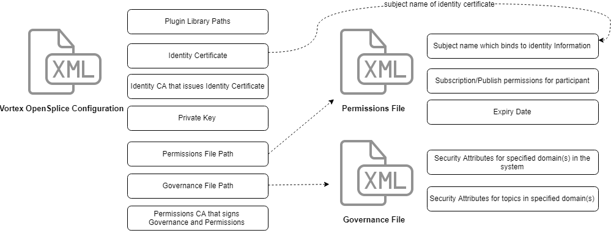

.. include:: ../external-links.part.rst

.. index:: 
    single: DDS security; Configuration
    single: Security; Configuration

.. _security_config:

**************************
DDS security configuration
**************************

.. toctree::
    :maxdepth: 1
    :hidden:

    plugins_config
    access_control_config

The configuration of DDS Security is split into two parts:

- :ref:`Plugins_Configuration`
- :ref:`Access_Control_Configuration`

