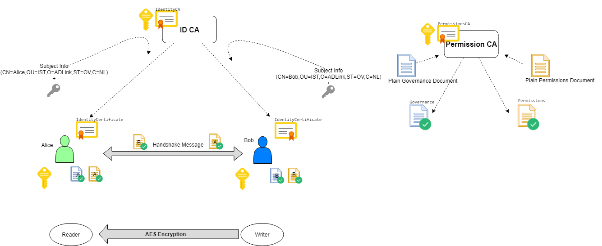

.. index:: 
   single: DDS security; Public-key infrastructure
   single: Security; Public-key infrastructure
   single: Public-key infrastructure
   single: Identity certificate
   single: Certificate authority

.. _public-key_infrastructure:

#########################
Public-key infrastructure
#########################

The comprehensive system required to provide public-key encryption and digital signature services
is known as a Public-Key Infrastructure (PKI). The purpose of a PKI is to manage keys and
certificates. By managing keys and certificates through a PKI, an organization establishes and
maintains a trustworthy networking environment.

**Public key cryptography**

Each user has a key pair, generated during the initial certificate deployment process. 
It consists of:

- A public key, which is shared.
- A private key, which is not shared. 

Data is encrypted with the user's public key and decrypted with their private key.

Digital signatures are also generated using public key cryptography (used for non-repudiation, 
authentication and data integrity).

.. _identity_certificate:

**Identity certificate**

This is an electronic document that proves the ownership of a public key. The certificate
includes:

- Information about the key.
- Information about the identity of its owner (called the subject).
- The digital signature of an entity that has verified the certificate's contents (called the issuer). 

If the signature is valid, and the software examining the certificate trusts the issuer, 
then it can use that key to communicate securely with the certificate's subject.

.. _certificate_authority:

**Certificate Authority (CA)**

This issues user-certificates and acts as the chief agent of trust. When issuing a certificate
to a user, the CA signs the certificate with its private key in order to validate it. During
electronic transactions the CA also confirms that certificates are still valid. Certificates
may be revoked for various reasons. For example, a user may leave the organization or they may
forget their secret passphrase, the certificate may expire or become corrupt. This process is
usually through the use of a Certificate Revocation List (CRL) which is a list of
the certificates that have been revoked. Only the certificates that have been revoked appear on
this list.

**Subject of identity certificate**

This is the identity to be secured. It contains information such as common name (CN),
organization (OU), state (ST) and country (C).

**Subject name**

This is also knows as the distinguished name. It is the string representation of the certificate 
subject. For example:

 emailAddress=alice\@zettascale.ist,CN=Alice,OU=IST,O=ADLink,ST=OV,C=NL

.. index:: Access control

*********************************
Example PKI usage in DDS security
*********************************

Alice and Bob are the DDS participants who have their private and public keys. Identitity
Certificate Authority (ID CA) has its own self-signed certificate (`IdentityCA` in the diagram).
**ID CA** gets Alice's subject information and public key and generates an `IdentityCertificate` for her.
Alice's certificate includes her public key and certificate of **ID CA**; so that her certificate can
be verified if it is really issued by ID CA.

Access Control is configured with governance and permissions documents:

- A governance document defines the security behavior of domains and topics. 
- A permissions document contains the permissions of the domain participant (topics, readers and 
  writers), and binds them to an identity certificate by subject name (distinguished name).

Governance documents and Permissions documents are signed by **Permission CA**. Signed documents also
contains Permissions CA certificate so that they can be verified that they are really issued
by Permissions CA.

Authenticated participants perform a handshake with each other and generate a shared key by
Diffie-Hellman key exchange. This shared key is used for encrypting/decrypting data with AES.

During the handshake:

- Alice checks Bob's certificate and Bob's Permissions document to see whether they are really 
  issued by the ID CA certificate and Permissions CA Certificate that **she** has.

- Bob checks Alice's certificate and Alice's Permissions document to see whether they are really 
  issued by the ID CA certificate and Permissions CA that **he** has.

.. needs a better description:

Permissions documents can contain permissions for several identities. To establish a binding between an 
identity and its permissions, the subject name of an identity certificate can appear multiple times in 
a permissions document.

There are several ways to set up the certificates and signed configuration files to be used with
|var-project-short| Security, see :ref:`Example_security_configuration`.
