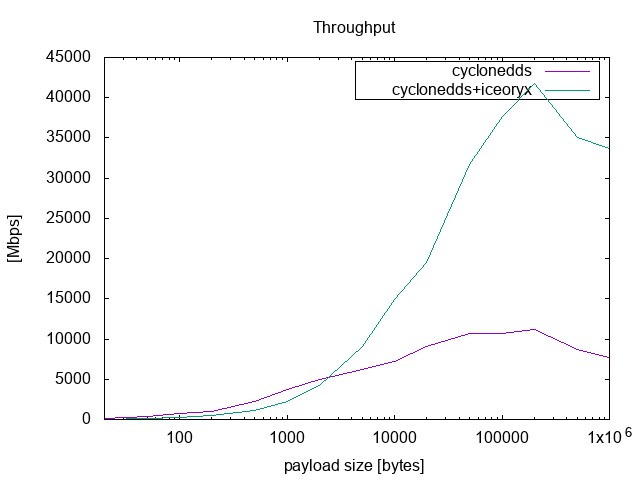

.. _`Shared Memory`:

#############
Shared Memory
#############

The documentation is to describe the Proof of Concepts detail of supporting shared memory in Cyclone DDS.
The shared memory implementation is based on `Eclipse iceoryx <https://projects.eclipse.org/proposals/eclipse-iceoryx>`_.

*****
Build
*****

The following step is under Ubuntu 18.04, but other Linux distribution should also work, too.

Before using iceoryx, there are some dependecies which should be installed.
These packages are used by iceoryx.

.. code-block:: bash

  sudo apt install cmake libacl1-dev libncurses5-dev pkg-config maven

Since iceoryx is C++ implementation and doesn't provide C API, we use iceoryx_clib to provide C API.
Here we use colcon to build the project, including iceoryx, Cyclone DDS, and iceoryx_clib.

.. code-block:: bash

  mkdir -p ~/cyclone_iceoryx_ws/src
  cd ~/cyclone_iceoryx_ws/src
  git clone https://github.com/eclipse-cyclonedds/cyclonedds.git -b iceoryx
  git clone https://github.com/Adlink-ROS/iceoryx.git -b used_by_cyclone
  git clone https://github.com/Adlink-ROS/iceoryx_clib.git
  cd ~/cyclone_iceoryx_ws
  colcon build --cmake-args -DCMAKE_BUILD_TYPE=Release

***
Run
***

Setup the environment before trying to run Cyclone DDS.

.. code-block:: bash

  cd ~/cyclone_iceoryx_ws
  source install/local_setup.bash

We need to enable shared memory configuration to run with iceoryx.
Save the following xml as cyclonedds.xml.

.. code-block:: xml

  <?xml version="1.0" encoding="UTF-8" ?>
  <CycloneDDS xmlns="https://cdds.io/config" xmlns:xsi="http://www.w3.org/2001/XMLSchema-instance" xsi:schemaLocation="https://cdds.io/config https://raw.githubusercontent.com/eclipse-cyclonedds/cyclonedds/iceoryx/etc/cyclonedds.xsd">
      <Domain id="any">
          <SharedMemory>
              <Enable>true</Enable>
              <CacheSize>256</CacheSize>
          </SharedMemory>
      </Domain>
  </CycloneDDS>

Now we start to run Cyclone DDS with shared memory.
In the 1st terminal we will start RouDi.

.. code-block:: bash

  source install/local_setup.bash
  iox-roudi

The 2nd terminal will run "ddsperf pub".

.. code-block:: bash

  source install/local_setup.bash
  export CYCLONEDDS_URI=file://$PWD/cyclonedds.xml
  ddsperf pub size 16k

The 3rd terminal will run "ddsperf sub".

.. code-block:: bash

  source install/local_setup.bash
  export CYCLONEDDS_URI=file://$PWD/cyclonedds.xml
  ddsperf sub

You can compare the result between native Cyclone DDS and Cyclone DDS with shared memory.
Note that you can't run "ddsperf sub" before "ddsperf pub".
It's related to mulitple publishers issue, and you can refer to the `Limitations`_.

***********
Performance
***********

Here is the performance test to compare the throughput between Cyclone DDS and Cyclone DDS with shared memory.

* Platform: `ADLINK ROScube-I <https://www.adlinktech.com/Products/ROS2_Solution/ROS2_Controller/ROScube-I?Lang=en#tab-24647>`_

  - CPU: Intel(R) Core(TM) i5-8400H CPU @ 2.50GHz
  - Memory: 16G

* OS: Ubuntu 18.04
* Test tools: `ddsperf <https://github.com/eclipse-cyclonedds/cyclonedds/tree/master/src/tools/ddsperf>`_

The result is based on default configuration and Cyclone DDS release build.
You can see that the throughput becomes much better as payload size increases.

*************
To developers
*************

The initial implementation is from `ADLINK Advanced Robotics Platform Group <https://github.com/adlink-ROS/>`_,
but still needs feedback and improvement from community.
It would be better if anyone also has some ideas and wants to improve it.
Here is some tips for you to get started.

- Most of the shared memory modification is under the define "DDSI_INCLUDE_SHM".
  You can search the define to have a quick scan.
- If you are curious about the detail of what is inside the iceoryx,
  There are a useful tool from iceoryx called iceoryx_introspection_client.

  .. code-block:: bash

    source install/local_setup.bash
    iox-introspection-client --all

- There are some configurations about showing log from shared memory.
  The Category "shm" under Tracing shows the Cyclone DDS log related to shared memory,
  while the LogLevel under SharedMemory decides which log level iceoryx shows.
  Please refer to the following XML.

  .. code-block:: xml
  
    <?xml version="1.0" encoding="UTF-8" ?>
    <CycloneDDS xmlns="https://cdds.io/config" xmlns:xsi="http://www.w3.org/2001/XMLSchema-instance" xsi:schemaLocation="https://cdds.io/config https://raw.githubusercontent.com/eclipse-cyclonedds/cyclonedds/iceoryx/etc/cyclonedds.xsd">
        <Domain id="any">
            <Tracing>
                <Category>shm</Category>
                <OutputFile>stdout</OutputFile>
            </Tracing>
            <SharedMemory>
                <Enable>true</Enable>
                <LogLevel>info</LogLevel>
                <CacheSize>256</CacheSize>
            </SharedMemory>
        </Domain>
    </CycloneDDS>

***********
Limitations
***********

Since the shared memory is still under POC stage, there are some limitations currently.

- Platform Support:
  Now the implementation can only run under the Linux environment.
  Since iceoryx also support MacOS and will have `Windows 10 support <https://github.com/eclipse/iceoryx/issues/33>`_ in the future,
  the support of MacOS and Windows is necessary.
- Multiple Publisher:
  iceoryx hasn't supported multi-publisher yet.
  If you have two publishers to the same topic, the second one will fail.
  Fortunately, this feature is `ongoing <https://github.com/eclipse/iceoryx/issues/25>`_ now.
- QoS Support:
  The current design doesn't consider the DDS QoS support.
  The suitable kind of data sent by shared memory only needs reliable and keep last, which are already supported by iceoryx.
  However, it would be nice if Cyclone DDS with shared memory also support QoS.
- True Zero copy:
  In fact, the current implementation is not zero copy, and still needs to copy data from user buffer into shared memory.
  To achieve zero copy, users must change the API they use and put the data into shared memory from the beginning.
  Although it needs some changes on user side, it'll improve the performance.

*********
TODO List
*********

- Use C API provided by iceoryx:
  iceoryx plans to provide `C API <https://github.com/eclipse/iceoryx/issues/252>`_.
  We may not need extra library (iceoryx_clib) anymore after that.
- Support DDS QoS:
  Please refer to the `Limitations`_.
- Support true zero copy:
  Please refer to the `Limitations`_.
