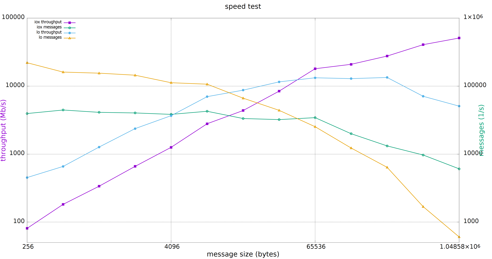

.. _`Shared Memory`:

Shared Memory
==============

This documentation is intended to describe the details of supporting shared memory exchange in Cyclone DDS, which is based on `Eclipse iceoryx <https://projects.eclipse.org/proposals/eclipse-iceoryx>`_.

Build
--------------

The following steps were done on Ubuntu 20.04.

Before compiling iceoryx, a number of packages which it depends on (cmake, libacl1, libncurses5, pkgconfig and maven) must be installed:

.. code-block:: bash

  sudo apt install cmake libacl1-dev libncurses5-dev pkg-config maven

Next you will need to get and build iceoryx (all of this is assumed to occur in your home directory):

.. code-block:: bash

  git clone https://github.com/eclipse-iceoryx/iceoryx.git -b master
  cd iceoryx
  cmake -Bbuild -DCMAKE_BUILD_TYPE=Debug -DCMAKE_INSTALL_PREFIX=install -DBUILD_SHARED_LIBS=ON -Hiceoryx_meta
  cmake --build build --config Debug --target install

After that, get Cyclone DDS (currently its iceoryx branch) and build it with shared memory support:

.. code-block:: bash

  git clone https://github.com/eclipse-cyclonedds/cyclonedds.git -b iceoryx
  cd cyclonedds
  cmake -Bbuild -DCMAKE_BUILD_TYPE=Debug -DCMAKE_INSTALL_PREFIX=install -DBUILD_EXAMPLES=On -DCMAKE_PREFIX_PATH=~/iceoryx/install/
  cmake --build build --config Debug --target install

When the compiler has finished, you should have built both iceoryx and Cyclone DDS. Their respective files can be found in the install directories which were created in the directories git has made for you.

Configuration
--------------

There are two levels of configuration for Cyclone DDS with shared memory support, the shared memory service (iceoryx) level, and the Cyclone DDS level.

The performance of the shared memory service is strongly dependent on how well its configuration matches up with the use cases it will be asked to support, and large gains in performance can be made by configuring it correctly.

The memory of iceoryx is layed out as numbers of fixed-size segments, which taken together are iceoryx's memory pool. When a subscriber requests a block of memory from iceoryx, the smallest block which will fit the requested size and is available is provided to the subscriber from the pool. If no blocks can be found which satisfy these requirements, the publisher requesting the block will give an error, and abort the process.

For testing, the default memory configuration usually suffices. The default configuration has blocks in varying numbers and sizes up to 4MiB, and iceoryx falls back to this configuration when it is not supplied with a suitable configuration file or cannot find one at the default location.

To ensure the best performance with the smallest footprint, the user is advised to configure iceoryx in such a manner that the memory pool only consists of blocks which will be useful to the exchanges to be done. Additionally, due to header information being sent along with the sample, the block size required from the pool is 64 bytes larger than the data type being exchanged. Lastly, iceoryx requires that the blocks be aligned to 4 bytes.

Below follows an example of an iceoryx configuration file which has a memory pool of 2^15 blocks which can store data types of 16384 bytes (+ 64 byte header = 16448 byte block):

.. code-block:: toml

  [general]
  version = 1

  [[segment]]

  [[segment.mempool]]
  size = 16448
  count = 32768

The configuration file used is supplied to iceoryx using the -c parameter. Please save this file as *iox_config.toml* in your home directory for future use in the `Run`_ section.
For detailed shared memory service documentation, the user is referred to `the iceoryx website <https://github.com/eclipse-iceoryx/iceoryx>`_.

Cyclone DDS also needs to be configured correctly, to allow it to use shared memory exchange.

The location where Cyclone DDS looks for the config file is set through the environment variable CYCLONEDDS_URI:

.. code-block:: bash

  export CYCLONEDDS_URI=file://cyclonedds.xml

The following optional configuration parameters in SharedMemory govern how Cyclone DDS treats shared memory:

* Enable

  * when set to *true* enables cyclonedds to use shared memory for local data exchange

  * defaults to *false*

* LogLevel

  * controls the output of the iceoryx runtime and can be set to, in order of decreasing output:

    * *verbose*

    * *debug*

    * *info* (default)

    * *warn*

    * *error*

    * *fatal*

    * *off*

Below follows an example of a Cyclone DDS configuration file supporting shared memory exchange:

.. code-block:: xml

  <?xml version="1.0" encoding="UTF-8" ?>
  <CycloneDDS xmlns="https://cdds.io/config"
              xmlns:xsi="http://www.w3.org/2001/XMLSchema-instance"
              xsi:schemaLocation="https://cdds.io/config https://raw.githubusercontent.com/eclipse-cyclonedds/cyclonedds/iceoryx/etc/cyclonedds.xsd">
      <Domain id="any">
          <SharedMemory>
              <Enable>true</Enable>              
              <LogLevel>info</LogLevel>
          </SharedMemory>
      </Domain>
  </CycloneDDS>

Please save the above example as *cyclonedds.xml* in your home directory for future use in the `Run`_ section.

Run
--------------

The configuration files from `Configuration`_ are a prerequisite for the correct functioning of the below examples.

Now, to start running Cyclone DDS with shared memory exchange.

In the 1st terminal we will start RouDi.

.. code-block:: bash

  ~/iceoryx/build/iox-roudi -c iox_config.toml

The 2nd terminal will run the publisher.

.. code-block:: bash

  export LD_LIBRARY_PATH=~/iceoryx/install/lib/${LD_LIBRARY_PATH:+:$LD_LIBRARY_PATH}
  export CYCLONEDDS_URI=file://cyclonedds.xml
  ~/cyclonedds/build/bin/ShmThroughputPublisher 16384 0 1 10 "Throughput example"

The 3rd terminal will run the subscriber.

.. code-block:: bash

  export LD_LIBRARY_PATH=~/iceoryx/install/lib/${LD_LIBRARY_PATH:+:$LD_LIBRARY_PATH}
  export CYCLONEDDS_URI=file://cyclonedds.xml
  ~/cyclonedds/build/bin/ShmThroughputSubscriber 10 0 "Throughput example" 16384

**N.B.**: for this example to run correctly, both the publisher and subscriber need to be given the same message type, which in this case is 16384 (the number of bytes in the message sent).

A typical result on the subscriber side will look something like this:

.. code-block:: bash

  Cycles: 10 | PollingDelay: 0 | Partition: Throughput example
  === [Subscriber] Waiting for samples...
  === [Subscriber] 1.000 Payload size: 16384 | Total received: 26587 samples, 435601408 bytes | Out of order: 0 samples Transfer rate: 26586.48 samples/s, 3484.74 Mbit/s
  === [Subscriber] 1.000 Payload size: 16384 | Total received: 51764 samples, 848101376 bytes | Out of order: 0 samples Transfer rate: 25176.43 samples/s, 3299.92 Mbit/s
  === [Subscriber] 1.000 Payload size: 16384 | Total received: 77666 samples, 1272479744 bytes | Out of order: 0 samples Transfer rate: 25901.57 samples/s, 3394.97 Mbit/s
  === [Subscriber] 1.000 Payload size: 16384 | Total received: 103328 samples, 1692925952 bytes | Out of order: 0 samples Transfer rate: 25661.24 samples/s, 3363.47 Mbit/s
  === [Subscriber] 1.000 Payload size: 16384 | Total received: 127267 samples, 2085142528 bytes | Out of order: 0 samples Transfer rate: 23938.74 samples/s, 3137.70 Mbit/s
  === [Subscriber] 1.000 Payload size: 16384 | Total received: 151643 samples, 2484518912 bytes | Out of order: 0 samples Transfer rate: 24375.11 samples/s, 3194.89 Mbit/s
  === [Subscriber] 1.000 Payload size: 16384 | Total received: 176542 samples, 2892464128 bytes | Out of order: 0 samples Transfer rate: 24898.70 samples/s, 3263.52 Mbit/s
  === [Subscriber] 1.000 Payload size: 16384 | Total received: 201916 samples, 3308191744 bytes | Out of order: 0 samples Transfer rate: 25373.31 samples/s, 3325.73 Mbit/s
  === [Subscriber] 1.000 Payload size: 16384 | Total received: 228113 samples, 3737403392 bytes | Out of order: 0 samples Transfer rate: 26196.68 samples/s, 3433.65 Mbit/s
  === [Subscriber] 1.000 Payload size: 16384 | Total received: 254555 samples, 4170629120 bytes | Out of order: 0 samples Transfer rate: 26441.99 samples/s, 3465.80 Mbit/s
  
  Total received: 254555 samples, 4170629120 bytes
  Out of order: 0 samples
  Average transfer rate: 25455.50 samples/s, Maximum transfer rate: 26586.48 samples/s, Average throughput : 3336.50 Mbit/s
  Maximum throughput : 3484.74 Mbit/s

Shared memory is especially suited for exchanging large messages:

The relative performances are dependant on a large number of factors such as message size, iceoryx memory pool configuration, number of other exchanges taking place, and many others. Individual results may therefore differ.

Limitations
--------------

Due to the manner in which the shared memory exchange functions, some limitations to the types of data and delivery are required to ensure their correct functioning.

First, the data types to be exchanged need to have a fixed size. This precludes the use of strings and sequences at any level in the data type, though this does not prevent the use of arrays, as their size is fixed at compile time. If any of these types of member variables are encountered in the IDL code generating the data types, shared memory exchange is disabled.

A possible workaround for this limitation is using fixed size arrays of chars in stead of strings, and arrays of other types in stead of sequences, and take any overhead for granted.

Second, the manner in which the iceoryx memory pool keeps track of exchanged data puts a number of limitations on the QoS settings.
For writers, the following QoS settings are prerequisites for shared memory exchange:

* Liveliness

  * DDS_LIVELINESS_AUTOMATIC

* Deadline

  * DDS_INFINITY

* Reliability

  * DDS_RELIABILITY_RELIABLE

* Durability

  * DDS_DURABILITY_VOLATILE

* History

  * DDS_HISTORY_KEEP_LAST

  * with depth no larger than the publisher history capacity as set in the configuration file

Whereas for readers, the following QoS settings are prerequisites for shared memory exchange:

* Liveliness

  * DDS_LIVELINESS_AUTOMATIC

* Deadline

  * DDS_INFINITY

* Reliability

  * DDS_RELIABILITY_RELIABLE

* Durability

  * DDS_DURABILITY_VOLATILE

* History

  * DDS_HISTORY_KEEP_LAST

  * with depth no larger than the subscriber history request as set in the configuration file

If any of these prerequisites are not satisfied, shared memory exchange will be disabled and data transfer will fall back to the network interface.

A further limitation is the maximum number of subscriptions per process for the iceoryx service, which is 127.

Lastly, there is the limit on the operating system. Iceoryx currently has no functioning implementation for the Windows operating system, this is `under development <https://github.com/eclipse/iceoryx/issues/33>`_.

Loan Mechanism
--------------

If the choice to use shared memory exchange is made, additional performance gains can be made by using the loan mechanism on the writer side.
The loan mechanism directly allocates memory from the iceoryx shared memory pool, and provides this to the user in the shape of the message data type.
Thereby eliminating a copy step in the publication process.

.. code-block:: C

  message_type *loaned_sample;
  dds_return_t status = dds_loan_sample(writer, (void**)&loaned_sample);

If *status* returns **DDS_RETCODE_OK**, then *loaned_sample* will contain a pointer to the memory pool object, in all other cases, *loaned_sample* should not be dereferenced.
For requesting loaned samples, the writer used to request the loaned sample should be of the same data type as the sample that you are writing in it, since necessary information about the data type is supplied by the writer.

The user is limited in this case by the maximum number of outstanding loans, defined by **MAX_PUB_LOANS** (default set to 8). This is the maximum number of loaned samples that each publisher can have outstanding from the shared memory, before some must be returned (handed back to the publisher through *dds_write*) before requesting new loaned samples.

After a loaned sample has been returned to the shared memory pool (at the moment, this can only be done by invoking *dds_write*), dereferencing the pointer is undefined behaviour.

If the user is not able to use the loan mechanism, a *dds_write* will still write to the shared memory service if Cyclone DDS is configured to use shared memory. Though in this case, the overhead of an additional copy step in publication is incurred, since a block for publishing to the shared memory will be requested and the data of the published sample copied into it.

Developer Hints
---------------

The initial implementation is from `ADLINK Advanced Robotics Platform Group <https://github.com/adlink-ROS/>`_.
Contributions were made by `Apex.AI <https://www.apex.ai/>`_ in order to integrate the latest iceoryx C-API to support zero copy data transfer.
Further contributions and feedback from the community are very welcome.

Below are some tips for you to get started:

* Most of the shared memory modification is under the define **DDS_HAS_SHM**, you can search the define to have a quick scan

* If you are curious about the internal happenings of the iceoryx service, there is a useful tool from iceoryx called iceoryx_introspection_client:

  .. code-block:: bash

    ~/iceoryx/build/iox-introspection-client --all

* CycloneDDS can be configured to show logging information from shared memory.

  * Setting Tracing::Category to *shm* shows the Cyclone DDS log related to shared memory, while SharedMemory::LogLevel decides which log level iceoryx shows:

  .. code-block:: xml
  
    <?xml version="1.0" encoding="UTF-8" ?>
    <CycloneDDS xmlns="https://cdds.io/config"
                xmlns:xsi="http://www.w3.org/2001/XMLSchema-instance"
                xsi:schemaLocation="https://cdds.io/config https://raw.githubusercontent.com/eclipse-cyclonedds/cyclonedds/iceoryx/etc/cyclonedds.xsd">
        <Domain id="any">
            <Tracing>
                <Category>shm</Category>
                <OutputFile>stdout</OutputFile>
            </Tracing>
            <SharedMemory>
                <Enable>true</Enable>
                <LogLevel>info</LogLevel>
            </SharedMemory>
        </Domain>
    </CycloneDDS>

TODO List
--------------

* Extend configuration options for Shared Memory
* Remove superfluous copy steps due to publishing returning ownership of shared memory blocks to iceoryx
