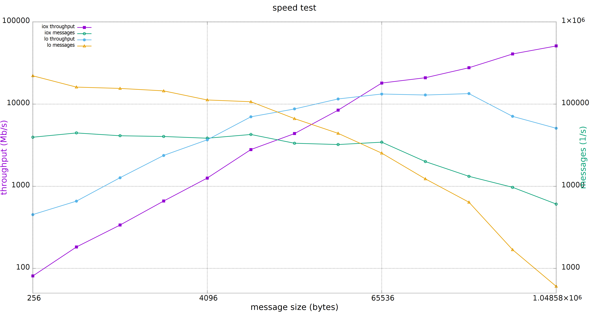

.. index:: Shared memory; Examples

.. _shared_mem_example:

Shared memory examples
======================

.. note::
  The configuration files from :ref:`shared_mem_config` are a prerequisite for the 
  following examples.

To start running |var-project-short| with shared memory exchange:

#. Open three terminals.
#. In the first terminal, start ``RouDi``:

   .. code-block:: console

     ~/iceoryx/build/iox-roudi -c iox_config.toml

#. In the second terminal, run the publisher.

   .. code-block:: console

     export LD_LIBRARY_PATH=~/iceoryx/install/lib/${LD_LIBRARY_PATH:+:$LD_LIBRARY_PATH}
     export CYCLONEDDS_URI=file://cyclonedds.xml
     ~/cyclonedds/build/bin/ShmThroughputPublisher 16384 0 1 10 "Throughput example"

#. In the third terminal, run the subscriber.

   .. code-block:: console

     export LD_LIBRARY_PATH=~/iceoryx/install/lib/${LD_LIBRARY_PATH:+:$LD_LIBRARY_PATH}
     export CYCLONEDDS_URI=file://cyclonedds.xml
     ~/cyclonedds/build/bin/ShmThroughputSubscriber 10 0 "Throughput example" 16384

   .. note::
    Both the publisher and subscriber must be given the same message type, which for 
    this example is 16384 (the number of bytes in the message sent).

The following shows a typical result on the subscriber side:

.. code-block:: console

  Cycles: 10 | PollingDelay: 0 | Partition: Throughput example
  === [Subscriber] Waiting for samples...
  === [Subscriber] 1.000 Payload size: 16384 | Total received: 26587 samples, 435601408 bytes | Out of order: 0 samples Transfer rate: 26586.48 samples/s, 3484.74 Mbit/s
  === [Subscriber] 1.000 Payload size: 16384 | Total received: 51764 samples, 848101376 bytes | Out of order: 0 samples Transfer rate: 25176.43 samples/s, 3299.92 Mbit/s
  === [Subscriber] 1.000 Payload size: 16384 | Total received: 77666 samples, 1272479744 bytes | Out of order: 0 samples Transfer rate: 25901.57 samples/s, 3394.97 Mbit/s
  === [Subscriber] 1.000 Payload size: 16384 | Total received: 103328 samples, 1692925952 bytes | Out of order: 0 samples Transfer rate: 25661.24 samples/s, 3363.47 Mbit/s
  === [Subscriber] 1.000 Payload size: 16384 | Total received: 127267 samples, 2085142528 bytes | Out of order: 0 samples Transfer rate: 23938.74 samples/s, 3137.70 Mbit/s
  === [Subscriber] 1.000 Payload size: 16384 | Total received: 151643 samples, 2484518912 bytes | Out of order: 0 samples Transfer rate: 24375.11 samples/s, 3194.89 Mbit/s
  === [Subscriber] 1.000 Payload size: 16384 | Total received: 176542 samples, 2892464128 bytes | Out of order: 0 samples Transfer rate: 24898.70 samples/s, 3263.52 Mbit/s
  === [Subscriber] 1.000 Payload size: 16384 | Total received: 201916 samples, 3308191744 bytes | Out of order: 0 samples Transfer rate: 25373.31 samples/s, 3325.73 Mbit/s
  === [Subscriber] 1.000 Payload size: 16384 | Total received: 228113 samples, 3737403392 bytes | Out of order: 0 samples Transfer rate: 26196.68 samples/s, 3433.65 Mbit/s
  === [Subscriber] 1.000 Payload size: 16384 | Total received: 254555 samples, 4170629120 bytes | Out of order: 0 samples Transfer rate: 26441.99 samples/s, 3465.80 Mbit/s
  
  Total received: 254555 samples, 4170629120 bytes
  Out of order: 0 samples
  Average transfer rate: 25455.50 samples/s, Maximum transfer rate: 26586.48 samples/s, Average throughput : 3336.50 Mbit/s
  Maximum throughput : 3484.74 Mbit/s

Shared memory is especially suited for exchanging large messages:

The relative performances are dependant on a large number of factors such as:

- Message size
- iceoryx memory pool configuration
- Number of other exchanges taking place
- And so on

Individual results may therefore differ.
