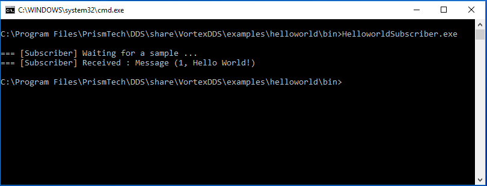

..
   Copyright(c) 2006 to 2018 ADLINK Technology Limited and others

   This program and the accompanying materials are made available under the
   terms of the Eclipse Public License v. 2.0 which is available at
   http://www.eclipse.org/legal/epl-2.0, or the Eclipse Distribution License
   v. 1.0 which is available at
   http://www.eclipse.org/org/documents/edl-v10.php.

   SPDX-License-Identifier: EPL-2.0 OR BSD-3-Clause

.. _`Installation`:

.. raw:: latex

    \newpage

##############################
Installing Eclipse Cyclone DDS
##############################

.. .. contents::

.. _`SystemRequirements`:

*******************
System requirements
*******************

At the time of writing, Eclipse Cyclone DDS is known to run on Linux, macOS and Windows. The build-process is not yet able to generate native packages.

***************
Linux and macOS
***************

.. _`CopyLinuxExamplesToUserFriendlyLocation`:

Post install steps
~~~~~~~~~~~~~~~~~~

The installation package installs examples in system directories.  In order to have a better user
experience when building the Eclipse Cyclone DDS examples, it is advised to copy the examples to a
user-defined location.  This is to be able to build the examples natively and experiment with the
example source code.

For this, the installation package provides the vdds_install_examples
script, located in /usr/bin.

Create an user writable directory where the examples should go. Navigate
to that directory and execute the script. Answer 'yes' to the questions
and the examples will be installed in the current location.

Type :code:`vdds_install_examples -h` for more information.

.. _`LinuxSetLibPath`:

Paths
=====

To be able to run Eclipse Cyclone DDS executables, the required libraries (like libddsc.so) need to
be available to the executables.  Normally, these are installed in system default locations and it
works out-of-the-box. However, if they are not installed in those locations, it is possible that the
library search path has to be changed.  This can be achieved by executing the command: ::

    export LD_LIBRARY_PATH=<install_dir>/lib:$LD_LIBRARY_PATH

*******
Windows
*******

.. _`WindowsSetLibPath`:

Paths
~~~~~

To be able to run Eclipse Cyclone DDS executables, the required libraries (like ddsc.dll) need to be
available to the executables.  Normally, these are installed in system default locations and it
works out-of-the-box. However, if they are not installed on those locations, it is possible that the
library search path has to be changed.  This can be achieved by executing the command: ::

    set PATH=<install_dir>/bin;%PATH%

.. _`TestYourInstallation`:

**********************
Test your installation
**********************

Eclipse Cyclone DDS includes a simple :ref:`Hello World! <HelloWorld>` application which can be run
in order to test your installation. The *Hello World!* application consists of two executables: a so
called HelloworldPublisher and a HelloworldSubscriber.

To run the example application, please open two console windows and navigate to the appropriate
directory in both console windows. Run the HelloworldSubscriber in one of the console windows by the
typing following command:

  :Windows: :code:`HelloworldSubscriber.exe`
  :Linux: :code:`./HelloworldSubscriber`

and the HelloworldPublisher in the other console window by typing:

  :Windows: :code:`HelloworldPublisher.exe`
  :Linux: :code:`./HelloworldPublisher`

The output HelloworldPublisher should look like

.. image:: ../_static/pictures/HelloworldPublisherWindows.png

while the HelloworldSubscriber will be looking like this

For more information on how to build this application your own and the code which has
been used, please have a look at the :ref:`Hello World! <HelloWorld>` chapter.
