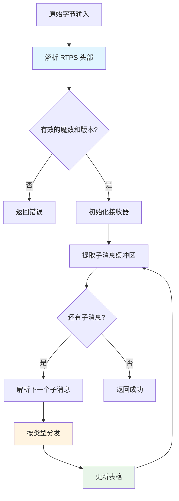

# RTPS Parser 的 Parse 函数详解

## 概述

位于 `/root/code/parker/AutoCoreDDS/src/tools/autocore.ai/pktparser/internal/rtps/rtps_parser.go` 第 90 行的 `Parse` 函数是**解析 RTPS（实时发布-订阅）协议消息的主入口**。RTPS 是 DDS（数据分发服务）用于分布式通信的网络协议。

**功能**：将原始网络数据包字节解析为结构化的 RTPS 消息组件，并提取发现和通信信息。

**难度级别**：中级到高级
**关键概念**：二进制协议解析、网络协议实现、DDS/RTPS 协议

---

## 这段代码的作用

### 高层次流程



---

## 逐步分解

### 步骤 1：解析和验证 RTPS 头部（第 91-102 行）

```go
hdr, err := newHeaderFromBytes(b)
if err != nil {
    return nil, err
}

if Magic != hdr.magic {
    return nil, errors.New("no magic here")
}

if hdr.protoVer.major < MY_RTPS_VERSION_MAJOR {
    return nil, errors.New("version too old")
}
```

**这里发生了什么：**
1. 从数据包的前几个字节提取 RTPS 头部
2. 验证魔数（标识数据包为 RTPS：`"RTPS"` = 0x52545053）
3. 检查协议版本兼容性

**可视化表示：**
```
字节布局：
┌─────────┬─────────┬─────────┬─────────┬──────────────┐
│  魔数   │ 协议    │  厂商   │  GUID    │   子消息     │
│ (4字节  │ 版本(2) │  ID(2)  │  前缀    │     ...      │
│ "RTPS") │         │         │ (12字节) │              │
└─────────┴─────────┴─────────┴──────────┴──────────────┘
```

---

### 步骤 2：初始化接收器上下文（第 106-112 行）

```go
rxer := receiver{
    srcProtoVer:   hdr.protoVer,
    srcVID:        hdr.vid,
    srcGUIDPrefix: hdr.guidPrefix,
}
p.rxer = &rxer
```

**目的**：创建一个跟踪以下内容的上下文对象：
- **源协议版本**：发送方使用的 RTPS 版本
- **源厂商 ID**：谁制造了这个 DDS 实现（例如：AutoCore、RTI、eProsima）
- **源 GUID 前缀**：发送参与者的唯一标识符（12 字节）

这个上下文在子消息解析过程中持续存在以维护状态。

---

### 步骤 3：提取子消息缓冲区（第 114 行）

```go
submsgbuf := b[8+len(hdr.guidPrefix):]
```

**计算过程：**
- 跳过 8 字节：魔数(4) + 协议版本(2) + 厂商 ID(2)
- 跳过 GUID 前缀（通常是 12 字节）
- 剩余字节包含子消息

---

### 步骤 4：子消息解析循环（第 116-131 行）

这是**核心解析逻辑**：

```go
for len(submsgbuf) >= 4 {
    submsg, err := newSubMsgFromBytes(submsgbuf)
    if err != nil {
        p.logger.Errorf("[Parse] 解析子消息失败: %v，跳过此数据包", err.Error())
        break
    }

    // 验证子消息头部大小的合理性，防止无限循环
    if submsg.hdr.sz > uint16(len(submsgbuf)-4) {
        p.logger.Errorf("[Parse] 子消息大小异常：声明%d字节，但剩余数据只有%d字节",
            submsg.hdr.sz, len(submsgbuf)-4)
        break
    }

    p.parseSubMsg(submsg)
    submsgbuf = submsgbuf[4+submsg.hdr.sz:]
}
```

**工作原理：**

1. **检查最小大小**：至少需要 4 字节作为子消息头部
2. **解析子消息头部**：提取类型、标志和大小
3. **验证大小**：防止缓冲区溢出攻击或损坏的数据包
4. **分发到处理器**：调用 `parseSubMsg()` 根据类型进行路由
5. **推进缓冲区**：跳过已处理的子消息（头部=4字节 + 载荷）

**可视化流程：**
```
子消息缓冲区：
┌───────────────┬───────────────┬───────────────┬─────
│  子消息 1     │  子消息 2     │  子消息 3     │ ...
│ [ID][F][SZ]   │ [ID][F][SZ]   │ [ID][F][SZ]   │
│    [数据...]  │    [数据...]  │    [数据...]  │
└───────────────┴───────────────┴───────────────┴─────
     ↓ 解析          ↓ 解析          ↓ 解析
     └─── 推进 ────┘
```

**安全特性**（第 124-127 行）：
验证检查可以防止损坏的数据包声称子消息大小超过可用数据时产生的无限循环。

---

### 步骤 5：子消息分发（第 129 行 → parseSubMsg）

`parseSubMsg()` 函数（第 141-236 行）将每个子消息路由到适当的处理器：

```go
func (p *Parser) parseSubMsg(sm *subMsg) {
    switch sm.hdr.id {
    case SUBMSG_ID_DATA:           // 用户数据
        p.parseData(sm)
    case SUBMSG_ID_INFO_TS:        // 时间戳信息
        p.parseInfoTS(sm)
    case SUBMSG_ID_HEARTBEAT:      // 可靠性协议
    case SUBMSG_ID_ACKNACK:        // 确认
    case SMID_ID_SEC_BODY:         // 加密数据
        p.parseSecBody(sm)
    // ... 20+ 种消息类型
    }
}
```

**关键子消息类型：**

| 类型 | 目的 | 处理器 |
|------|------|--------|
| `DATA` | 实际用户数据或发现信息 | `parseData()` |
| `INFO_TS` | 后续 DATA 的时间戳 | `parseInfoTS()` |
| `INFO_DST` | 目标 GUID | `parseInfoDst()` |
| `HEARTBEAT` | 可靠性："我有数据 X-Y" | （仅记录） |
| `ACKNACK` | 可靠性："发送给我数据 X-Y" | （仅记录） |
| `SEC_BODY` | 加密载荷 | `parseSecBody()` |

---

## 深入分析：DATA 子消息解析

最复杂的处理器是 `parseData()`（第 263-355 行）。它处理：

### 1. 发现消息（SPDP/SEDP）
- **SPDP**（简单参与者发现协议）：宣布新的 DDS 参与者
- **SEDP**（简单端点发现协议）：宣布读取器/写入器

```go
if p.isDataP(&smd) {
    p.parseDataP(sm, es.scheme, b)  // 参与者发现
} else if p.isDataR(&smd) {
    p.parseDataRW(sm, es.scheme, b, true)  // 读取器发现
} else if p.isDataW(&smd) {
    p.parseDataRW(sm, es.scheme, b, false) // 写入器发现
}
```

### 2. 用户数据
```go
else {
    p.userDataTable.Add(guid, seqNum, dataLen, timestamp)
}
```

**实体 ID 匹配：**
```go
func (p *Parser) isDataP(s *submsgData) bool {
    return s.writerID == ENTITYID_SPDP_BUILTIN_PARTICIPANT_WRITER &&
           (s.readerID == ENTITYID_SPDP_BUILTIN_PARTICIPANT_READER ||
            s.readerID == ENTITYID_UNKNOWN)
}
```

---

## 理解参与者发现

当调用 `parseDataP()` 时，它提取参与者信息：

```go
part := &Participant{}
for _, p := range plist {
    switch p.pid {
    case PID_DOMAIN_ID:
        part.domainID = binary.LittleEndian.Uint16(p.value[0:])
    case PID_PARTICIPANT_GUID:
        part.guid = GUID{prefix, entityID}
    case PID_DEFAULT_UNICAST_LOCATOR:
        part.defaultUcastLoc = newUDPv4LocFromBytes(p.value)
    case PID_PROPERTY_LIST:
        // 提取进程名称、PID、主机名
    }
}
p.partTable.Add(part)
```

**提取的内容：**
- 域 ID（哪个 DDS 域）
- GUID（唯一的参与者标识符）
- 网络定位器（通信的 IP:端口）
- 进程元数据（名称、PID、主机名）
- QoS 策略（租约期限等）

---

## 算法可视化：完整的解析流程

```
Parse(bytes) 执行：
│
├─> 1. 解析头部
│   ├─ 检查魔数："RTPS"? ✓
│   ├─ 检查版本：>= 2.0? ✓
│   └─ 提取 GUID 前缀
│
├─> 2. 初始化上下文
│   └─ 存储源信息（版本、厂商、GUID）
│
├─> 3. 循环处理子消息
│   │
│   ├─> 迭代 1：INFO_TS
│   │   ├─ 解析：提取时间戳
│   │   ├─ 存储到上下文：rxer.timestamp
│   │   └─ 推进缓冲区：+12 字节
│   │
│   ├─> 迭代 2：DATA（参与者）
│   │   ├─ 解析：提取参与者信息
│   │   ├─ 识别：isDataP() → true
│   │   ├─ 调用：parseDataP()
│   │   │   ├─ 解析参数列表
│   │   │   ├─ 提取：域、GUID、定位器、QoS
│   │   │   └─ 添加到：partTable
│   │   └─ 推进缓冲区：+268 字节
│   │
│   ├─> 迭代 3：DATA（读取器）
│   │   ├─ 解析：提取端点信息
│   │   ├─ 识别：isDataR() → true
│   │   ├─ 调用：parseDataRW(isReader=true)
│   │   │   ├─ 提取：主题名称、类型、QoS
│   │   │   └─ 添加到：readerTable
│   │   └─ 推进缓冲区：+184 字节
│   │
│   └─> ... 更多子消息
│
└─> 4. 返回成功
```

---

## 常见陷阱和安全特性

### ⚠️ 缓冲区溢出保护（第 124-127 行）

**问题**：恶意或损坏的数据包可能声称不切实际的子消息大小

**解决方案**：
```go
if submsg.hdr.sz > uint16(len(submsgbuf)-4) {
    p.logger.Errorf("[Parse] 子消息大小异常")
    break  // 停止处理此数据包
}
```

### ⚠️ 最小长度检查（第 273-276、308-311 行）

**问题**：在没有验证的情况下访问字节会导致 panic

**解决方案**：
```go
if len(sm.data) < 20 {
    p.logger.Errorf("[parseData] 子消息数据不足")
    return
}
```

### ⚠️ 优雅的错误处理（第 118-121 行）

**问题**：一个错误的子消息不应该导致整个解析器崩溃

**解决方案**：记录错误，跳过数据包，继续处理下一个

---

## 关键数据结构

### Parser 状态
```go
type Parser struct {
    logger        *xlog.Logger
    rxer          *receiver          // 当前解析上下文
    partTable     ParticipantTbl     // 已发现的参与者
    writerTable   WriterTbl          // 已发现的写入器
    readerTable   ReaderTbl          // 已发现的读取器
    userDataTable UserDataTbl        // 用户数据消息
    msgStats      map[string]int     // 消息类型计数
}
```

### Receiver 上下文
```go
type receiver struct {
    srcProtoVer   ProtoVersion
    srcVID        VendorID
    srcGUIDPrefix GuidPrefix
    timestamp     time.Time
    haveTimestamp bool
    dstGUIDPrefix GuidPrefix
}
```

---

## 性能特性

**时间复杂度**：O(n)，其中 n = 子消息数量
**空间复杂度**：O(m)，其中 m = 发现的唯一参与者/端点数
**缓冲区操作**：使用字节切片的零拷贝解析

---

## 实战示例

让我们跟踪一个典型的参与者宣告数据包：

```
输入字节（简化）：
┌────────────────────────────────────────────────┐
│ "RTPS" │ 2.4 │ 0x0118 │ 01020304...0C │      │
│  魔数  │ 版本│  厂商  │  GUID 前缀    │ 子消息│
└────────────────────────────────────────────────┘
                                         │
                    ┌────────────────────┴─────────────────┐
                    │ INFO_TS | DATA（参与者）             │
                    └──────────────────────────────────────┘

处理过程：
1. 头部：Magic=RTPS, Ver=2.4, Vendor=0x0118（AutoCore）
2. GUID：01:02:03:04:05:06:07:08:09:0A:0B:0C
3. 子消息 1：INFO_TS → timestamp = 2025-10-30 12:34:56
4. 子消息 2：DATA → 参与者
   - 域：0
   - GUID：01:02:03:04:05:06:07:08:09:0A:0B:0C:00:00:01:C1
   - 定位器：192.168.1.100:7400
   - 进程："my_app"，PID=12345

结果：新参与者添加到 partTable
```

---

## 学习路径

### 掌握这段代码：

**第 1-2 周：基础知识**
- 学习 Go 语言中的二进制协议解析
- 了解 RTPS 协议规范（OMG DDS-RTPS 规范）
- 理解 DDS 发现机制

**第 3-4 周：应用学习**
- 使用调试器跟踪执行
- 添加自定义日志以查看数据流
- 修改以解析新的子消息类型

**第 5-6 周：高级主题**
- 优化解析性能
- 添加安全子消息解密
- 实现 RTPS 消息生成（反向方向）

---

## 练习题

**挑战**：实现统计跟踪

添加功能来跟踪：
1. 每个数据包的平均子消息数
2. 最常见的子消息类型
3. 发现消息频率

**提示**：使用现有的 `msgStats` 字段（第 35 行）并在 `parseSubMsg()` 中更新它（已在第 145、149、153 等行部分实现）

---

## 深化理解的问题

1. **为什么魔数检查很重要？**（安全性/验证）
2. **如果我们删除第 124 行的大小验证会发生什么？**（可能会 panic）
3. **为什么在接收器上下文中存储时间戳而不是作为参数传递？**（跨子消息的状态管理）
4. **如何添加对新子消息类型的支持？**（在 parseSubMsg switch 中添加 case）

这个解析器是一个处理实时分布式通信的生产级实现——理解它可以让你深入了解协议设计和防御性编程实践！

---

## 文件位置

**源代码文件**：`/root/code/parker/AutoCoreDDS/src/tools/autocore.ai/pktparser/internal/rtps/rtps_parser.go`

**Parse 函数位置**：第 90 行

**相关文件**：
- `rtps_header.go` - RTPS 头部解析
- `proto.go` - 协议常量和子消息定义
- `rtps_data.go` - 数据结构定义
- `rtps_sedp.go` - 端点发现相关

---

## 总结

`Parse` 函数是一个健壮的二进制协议解析器，具有以下特点：

✅ **防御性编程**：多层验证防止崩溃
✅ **高效解析**：零拷贝字节切片操作
✅ **可扩展设计**：易于添加新的子消息类型
✅ **详细日志**：便于调试和监控
✅ **状态管理**：接收器上下文跨消息维护状态

这是在生产环境中解析复杂网络协议的优秀范例！
