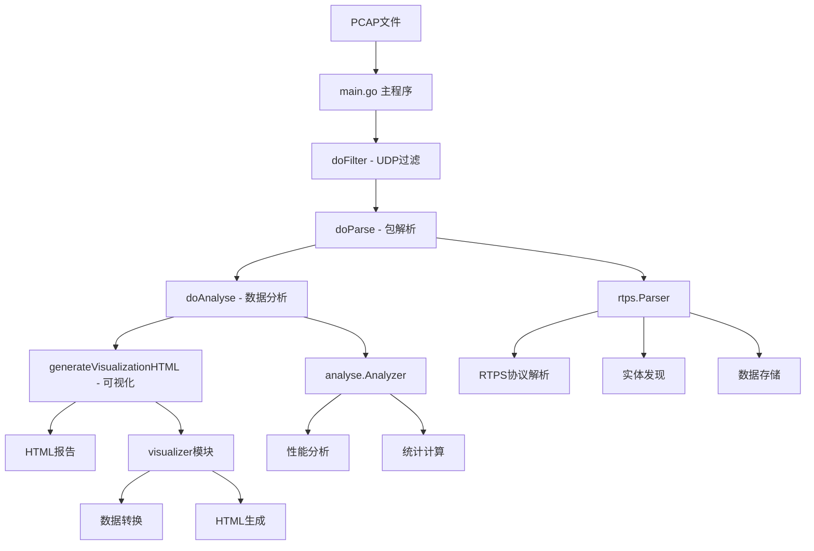
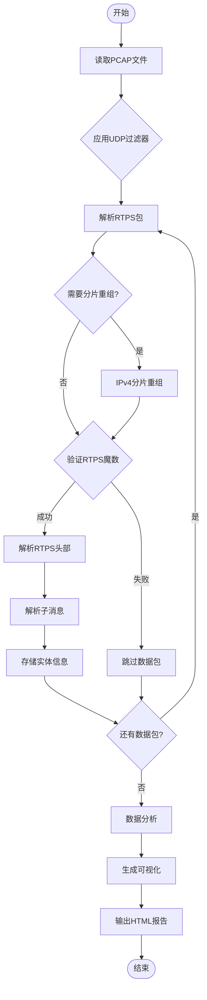
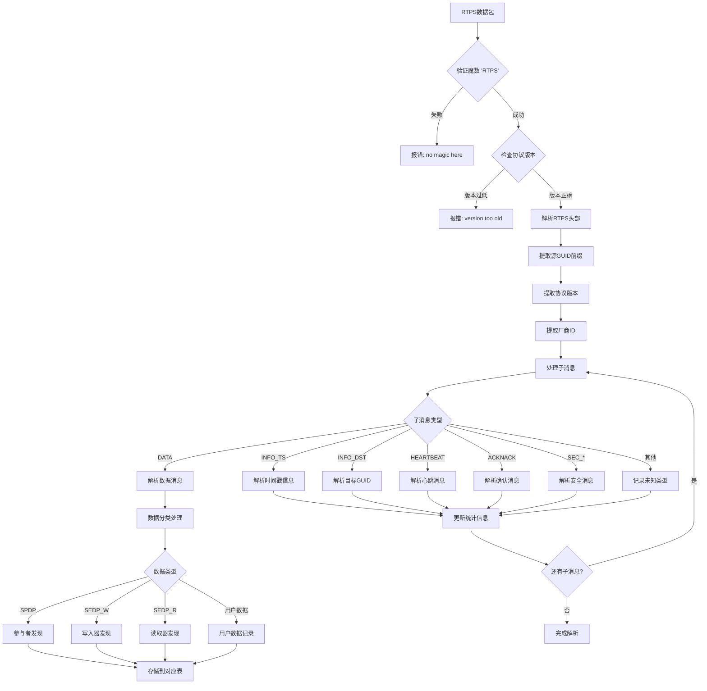
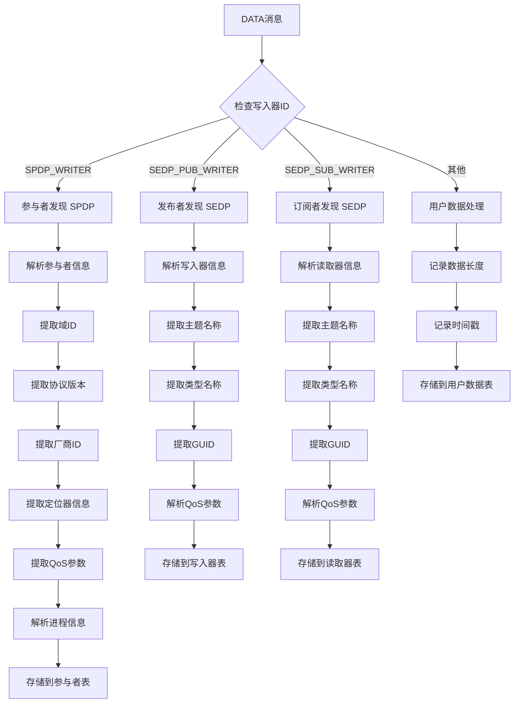
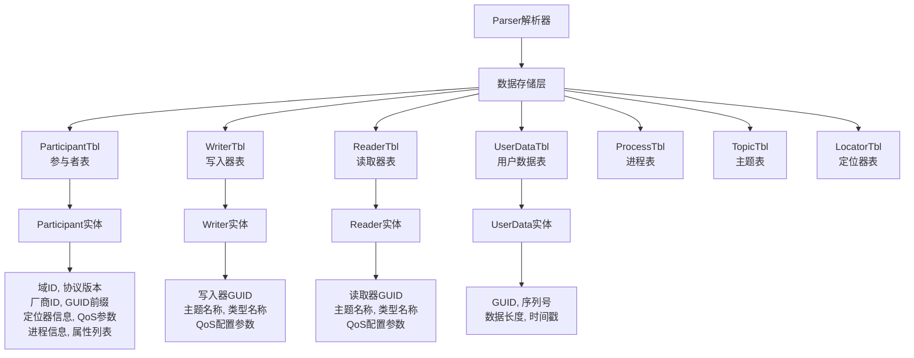
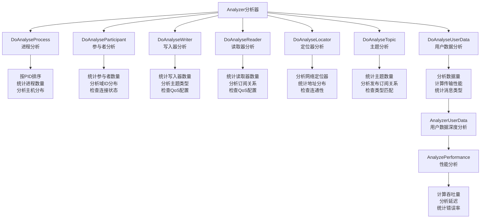
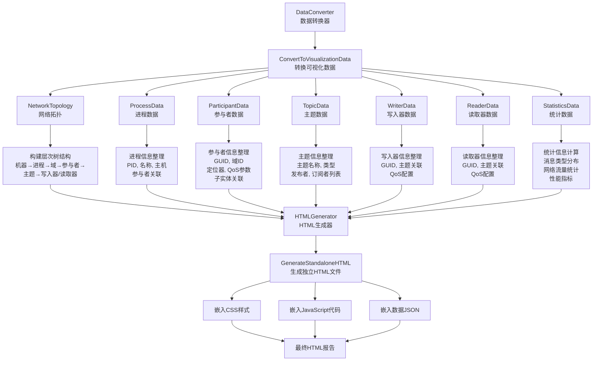

# pktparser - RTPS Packet Analysis Tool

## 概述

pktparser 是一个专门用于分析 RTPS (Real-Time Publish-Subscribe) 数据包的工具，它能够解析 DDS (Data Distribution Service) 网络通信的 PCAP 文件，提供详细的网络拓扑分析、实体发现、性能统计和可视化报告。

## 架构概览



## 目录结构

```
pktparser/
├── main.go                          # 主程序入口
├── internal/
│   ├── rtps/                        # RTPS协议解析核心
│   │   ├── rtps_parser.go          # 主解析器
│   │   ├── proto.go                # 协议常量定义
│   │   ├── participant.go          # 参与者实体
│   │   ├── store_*.go              # 各种数据存储表
│   │   └── ...
│   ├── analyse/                     # 数据分析模块
│   │   ├── analyzer.go             # 主分析器
│   │   └── analyzer_userdata.go    # 用户数据分析
│   ├── visualizer/                  # 可视化模块
│   │   ├── data_converter.go       # 数据转换
│   │   ├── data_models.go          # 数据模型
│   │   └── html_generator.go       # HTML生成
│   ├── config/                      # 配置管理
│   └── cli/                         # 命令行接口
└── pkg/
    ├── errcode/                     # 错误代码
    └── xlog/                        # 日志系统
```

## 主要流程图

### 1. 整体处理流程



### 2. RTPS 解析详细流程



### 3. 实体发现流程 (SPDP/SEDP)



### 4. 数据存储架构



### 5. 分析处理流程



### 6. 可视化生成流程



## 关键数据结构

### 1. 核心实体结构

```go
// 参与者实体
type Participant struct {
    domainID         DomainID
    protoVer         ProtoVersion
    vid              VendorID
    guidPrefix       GUIDPrefix
    guid             GUID
    expectsInlineQoS bool
    defaultUcastLoc  locator      // 默认单播定位器
    defaultMcastLoc  locator      // 默认组播定位器
    metaUcastLoc     locator      // 元数据单播定位器
    metaMcastLoc     locator      // 元数据组播定位器
    leaseDuration    time.Duration
    builtinEndpoints builtinEndpointSet
    processName      string
    processID        string
    hostname         string
    autoCoreCode     []byte
    userData         []byte
    groupData        []byte
    topicData        []byte
    manualLivelinessCount uint32
    propertyList     []string
}

// 解析器主结构
type Parser struct {
    logger        *xlog.Logger
    rxer          *receiver
    partTable     ParticipantTbl    // 参与者表
    writerTable   WriterTbl         // 写入器表
    readerTable   ReaderTbl         // 读取器表
    userDataTable UserDataTbl       // 用户数据表
    processTable  ProcessTbl        // 进程表
    topicTable    TopicTbl          // 主题表
    locatorTable  LocatorTbl        // 定位器表
    msgStats      map[string]int    // 消息统计
}
```

### 2. RTPS 协议常量

```go
// 子消息类型
const (
    SUBMSG_ID_PAD            = 0x01
    SUBMSG_ID_ACKNACK        = 0x06
    SUBMSG_ID_HEARTBEAT      = 0x07
    SUBMSG_ID_GAP            = 0x08
    SUBMSG_ID_INFO_TS        = 0x09
    SUBMSG_ID_INFO_DST       = 0x0e
    SUBMSG_ID_DATA           = 0x15
    SUBMSG_ID_DATA_FRAG      = 0x16
    // 安全相关子消息
    SMID_ID_SEC_BODY         = 0x30
    SMID_ID_SEC_PREFIX       = 0x31
    SMID_ID_SEC_POSTFIX      = 0x32
    SMID_ID_SRTPS_PREFIX     = 0x33
    SMID_ID_SRTPS_POSTFIX    = 0x34
)

// 内置端点实体ID
const (
    ENTITYID_SPDP_BUILTIN_PARTICIPANT_WRITER      = 0x000100c2
    ENTITYID_SPDP_BUILTIN_PARTICIPANT_READER      = 0x000100c7
    ENTITYID_SEDP_BUILTIN_PUBLICATIONS_WRITER     = 0x000003c2
    ENTITYID_SEDP_BUILTIN_PUBLICATIONS_READER     = 0x000003c7
    ENTITYID_SEDP_BUILTIN_SUBSCRIPTIONS_WRITER    = 0x000004c2
    ENTITYID_SEDP_BUILTIN_SUBSCRIPTIONS_READER    = 0x000004c7
)
```

## 支持的功能特性

### 1. RTPS 协议支持
- **标准子消息**: DATA, HEARTBEAT, ACKNACK, GAP, INFO_TS, INFO_DST 等
- **安全子消息**: SEC_BODY, SEC_PREFIX, SEC_POSTFIX, SRTPS_PREFIX, SRTPS_POSTFIX
- **厂商特定**: 支持厂商扩展子消息
- **分片处理**: IPv4 分片包重组
- **QoS 参数**: 可靠性、持久性、生存期、截止期等

### 2. 实体发现
- **SPDP**: 简单参与者发现协议
- **SEDP**: 简单端点发现协议
- **内置端点**: 自动识别 DDS 内置端点
- **用户端点**: 应用层读写器发现

### 3. 网络分析
- **拓扑发现**: 自动构建网络拓扑图
- **性能统计**: 吞吐量、延迟、丢包率分析
- **流量分析**: 单播/组播流量统计
- **连接监控**: 参与者连接状态跟踪

### 4. 可视化输出
- **交互式HTML**: 响应式Web界面
- **多视图展示**: 拓扑图、统计图表、详细列表
- **搜索过滤**: 支持实体搜索和过滤
- **数据导出**: 支持数据导出功能

## 使用方法

### 命令行语法

```bash
pktparser <pcap_file> [--output OUTPUT_FILE] [--no-viz]
```

### 参数说明

- `<pcap_file>`: 输入的 PCAP 文件路径
- `--output OUTPUT_FILE`: 指定输出 HTML 文件路径 (默认: `<pcap_filename>_analysis.html`)
- `--no-viz`: 禁用可视化 HTML 生成，仅显示控制台输出

### 使用示例

```bash
# 基本用法
./pktparser capture.pcap

# 指定输出文件
./pktparser capture.pcap --output report.html

# 仅控制台输出
./pktparser capture.pcap --no-viz
```

## 输出说明

### 1. 控制台输出
- 数据包处理统计
- 发现的实体数量
- 错误和警告信息
- 分析结果摘要

### 2. HTML 可视化报告
- **概览页**: 整体统计信息和快速导航
- **网络拓扑**: 分层树状结构显示
- **进程列表**: 按 PID 排序的进程信息
- **参与者**: 详细的参与者信息和关联实体
- **主题**: 主题及其发布/订阅关系
- **写入器/读取器**: 端点详细信息和 QoS 配置

### 3. 分析统计
- 消息类型分布饼图
- 域统计图表
- 参与者活动图
- 网络流量统计

## 技术特点

### 1. 高性能处理
- 零拷贝缓冲区设计
- 增量式数据解析
- 高效的内存管理

### 2. 协议完整性
- 完整的 RTPS 2.1+ 协议支持
- DDS 安全扩展支持
- 多厂商兼容性

### 3. 可扩展架构
- 模块化设计
- 插件式分析器
- 自定义可视化

### 4. 错误处理
- 全面的错误检测
- 详细的错误报告
- 容错性处理机制

## 依赖项

- **Go 1.19+**: 基础运行环境
- **gopacket**: 网络包处理库
- **Chart.js**: 图表可视化库 (HTML中引用)
- **标准库**: encoding/binary, time, strings 等

## 未来扩展

### 计划功能
- 实时包分析支持
- 更多协议支持 (如 DDS-XRCE)
- 性能基准测试
- 自定义分析规则
- 数据导出格式扩展 (JSON, CSV, XML)

### 优化方向
- 内存使用优化
- 大文件处理性能
- 并发处理能力
- 用户界面改进

## 结论

pktparser 是一个功能全面的 RTPS/DDS 数据包分析工具，具有强大的协议解析能力、丰富的分析功能和直观的可视化界面。它不仅可以帮助开发者调试 DDS 应用程序，还能为网络管理员提供深入的网络行为洞察，是 DDS 生态系统中不可或缺的分析工具。